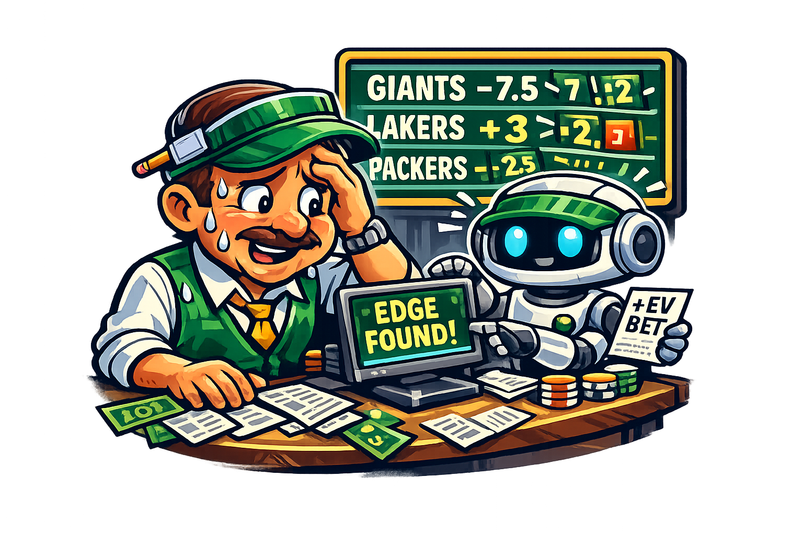

# Bookie Breaker

A distributed system for sports gambling predictions that identifies +EV (positive expected value) betting edges against sportsbooks.

**Sports:** NFL, NBA, MLB, NCAA Football, NCAA Basketball, NCAA Baseball
**Approach:** Hybrid prediction — Monte Carlo simulation generates base probabilities, ML models adjust for contextual factors

---

## Documentation Index

### Architecture
- [System Overview](architecture/system-overview.md) — High-level architecture diagram
- [Data Flow](architecture/data-flow.md) — End-to-end data flow through the system
- [Communication Patterns](architecture/communication-patterns.md) — How services communicate
- [Feature Inventory](architecture/feature-inventory.md) — Complete list of system features
- [Sequence Diagrams](architecture/sequence-diagrams.md) — Detailed interaction sequences

### Components
- [Agent](components/agent.md) — LLM-powered orchestrator and analyst
- [Bookie Emulator](components/bookie-emulator.md) — Paper trading with accuracy tracking
- [CLI](components/cli.md) — Command-line interface
- [Infra Ops](components/infra-ops.md) — Infrastructure, Docker, CI/CD
- [Lines Service](components/lines-service.md) — Betting lines/odds data ingestion and serving
- [MCP Server](components/mcp-server.md) — Model Context Protocol server for LLM integration
- [Prediction Engine](components/prediction-engine.md) — ML models for prediction adjustment
- [Simulation Engine](components/simulation-engine.md) — Monte Carlo game simulations
- [Statistics Service](components/statistics-service.md) — Historical/statistical data processing
- [UI](components/ui.md) — Web dashboard

### API Contracts
- [API Design Principles](api-contracts/README.md)
- Per-service API specs (TBD)

### Schemas
- [Domain Models](schemas/domain-models.md) — Core domain entities
- [Database Schemas](schemas/database-schemas/) — Per-service storage schemas
- [Event Schemas](schemas/event-schemas/) — Message/event formats

### Research
- [Lines Data Sources](research/lines-data-sources.md) — Betting lines API evaluation
- [Statistics Data Sources](research/statistics-data-sources.md) — Sports stats API evaluation
- [Sport Modeling Analysis](research/sport-modeling-analysis.md) — Per-sport simulation considerations

### Algorithms
- [Simulation Algorithms](algorithms/simulation-algorithms.md) — Monte Carlo framework design
- [Prediction Models](algorithms/prediction-models.md) — ML model architecture
- [Edge Detection](algorithms/edge-detection.md) — EV calculation and position sizing

### Operations
- [Dev Workflow](operations/dev-workflow.md) — Local development setup
- [Testing Strategy](operations/testing-strategy.md) — Testing approach across services
- [Monitoring & Observability](operations/monitoring-observability.md) — Logging, metrics, alerting
- [Security Model](operations/security-model.md) — Secrets, auth, access control
- [Error Handling](operations/error-handling.md) — Resilience and failure recovery
- [CI/CD & GitHub Integration](operations/ci-cd-github.md) — Pipelines, templates, Renovate, shared workflows

### Decisions
- [ADR Template](decisions/000-template.md)
- [001 — Sport-Agnostic Framework](decisions/001-sport-agnostic-framework.md)
- [002 — Hybrid Prediction Approach](decisions/002-hybrid-prediction-approach.md)
- [003 — Paper Trading Mode](decisions/003-paper-trading-mode.md)
- [004 — Three Equal Interfaces](decisions/004-three-equal-interfaces.md)
- [005 — Containerized Deployment](decisions/005-containerized-deployment.md)
- [006 — Best Tool Per Service](decisions/006-best-tool-per-service.md)
- [007 — Lines Data Sources](decisions/007-lines-data-sources.md)
- [008 — Statistics Data Sources](decisions/008-statistics-data-sources.md)
- [009 — Shared Code Strategy (OpenAPI Codegen)](decisions/009-shared-code-strategy.md)
- [010 — Tech Stack Selection](decisions/010-tech-stack-selection.md)

### Roadmap
- [Implementation Phases](roadmap/implementation-phases.md) — 7-phase vertical slice build plan (NBA first, then expand)
- [Milestones](roadmap/milestones.md) — Key milestones and success criteria

### Per-Repo Planning
Each service repo contains a `PLANNING.md` with ordered task lists, dependencies, and definition of done:
- [infra-ops](../bookie-breaker-infra-ops/PLANNING.md) — Phase 1: Docker Compose, Taskfile, Postgres, Redis
- [statistics-service](../bookie-breaker-statistics-service/PLANNING.md) — Phase 1: Sports stats ingestion and caching (Go)
- [lines-service](../bookie-breaker-lines-service/PLANNING.md) — Phase 1: Betting lines ingestion and serving (Go)
- [simulation-engine](../bookie-breaker-simulation-engine/PLANNING.md) — Phase 2: Monte Carlo simulations (Python)
- [prediction-engine](../bookie-breaker-prediction-engine/PLANNING.md) — Phase 2: ML calibration and prediction (Python)
- [agent](../bookie-breaker-agent/PLANNING.md) — Phase 3/4: Pipeline orchestration and LLM analysis (Python)
- [bookie-emulator](../bookie-breaker-bookie-emulator/PLANNING.md) — Phase 3: Paper trading system (Python)
- [cli](../bookie-breaker-cli/PLANNING.md) — Phase 3: Terminal interface (Go/Charm)
- [mcp-server](../bookie-breaker-mcp-server/PLANNING.md) — Phase 4: MCP tool server (Python)
- [ui](../bookie-breaker-ui/PLANNING.md) — Phase 5: Web dashboard (SvelteKit)
