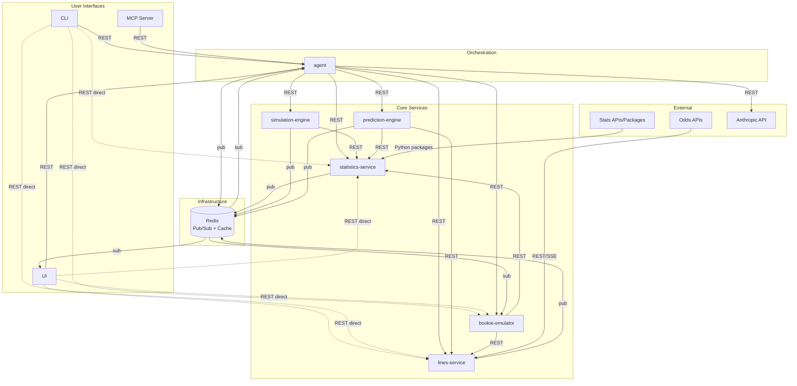
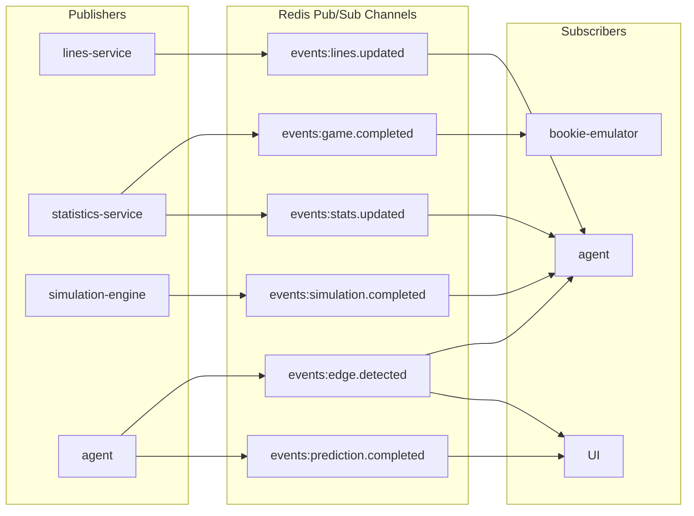

# Communication Patterns

How BookieBreaker services communicate with each other. This document builds on the [data flow
architecture](data-flow.md) and prioritizes simplicity appropriate for a solo developer project.

---

## 1. Synchronous Communication (REST)

Most service-to-service communication in BookieBreaker is synchronous request/response over JSON REST APIs. This is the
default pattern unless there is a specific reason to use async.

### Which Calls Are Synchronous

| Caller            | Callee             | Purpose                               | Why Sync                                             |
| ----------------- | ------------------ | ------------------------------------- | ---------------------------------------------------- |
| agent             | simulation-engine  | Run simulations for matchups          | Agent needs results to proceed to next pipeline step |
| agent             | prediction-engine  | Generate calibrated predictions       | Agent needs results for edge detection               |
| agent             | lines-service      | Get current lines for edge comparison | Agent needs lines immediately to compare             |
| agent             | statistics-service | Get stats for LLM context             | Agent needs data to build prompt                     |
| agent             | bookie-emulator    | Place paper bet, query performance    | Agent needs confirmation/data to respond to user     |
| agent             | Anthropic API      | LLM analysis generation               | Agent needs response to deliver to user              |
| simulation-engine | statistics-service | Get team/player params for simulation | Simulation cannot start without parameters           |
| prediction-engine | statistics-service | Get contextual features               | ML model needs features as input                     |
| prediction-engine | lines-service      | Get line movement data                | ML model needs market features                       |
| bookie-emulator   | lines-service      | Get current odds, closing lines       | Needs exact odds at moment of placement              |
| bookie-emulator   | statistics-service | Get final game scores                 | Needs scores to grade bets                           |
| CLI / UI / MCP    | agent              | User queries, commands                | User is waiting for response                         |
| CLI / UI / MCP    | any service        | Direct data lookups (lines, stats)    | User is waiting for response                         |

### API Conventions

**Base URL pattern:** `http://{service-name}:{port}/api/v1/{resource}`

**Standard response envelope:**

```json
{
  "data": {},
  "meta": {
    "timestamp": "2026-03-30T14:22:00Z",
    "request_id": "uuid",
    "version": "v1"
  }
}
```

**Error response envelope:**

```json
{
  "error": {
    "code": "RESOURCE_NOT_FOUND",
    "message": "No lines found for game ID abc-123",
    "details": {}
  },
  "meta": {
    "timestamp": "2026-03-30T14:22:00Z",
    "request_id": "uuid"
  }
}
```

**Versioning:** URL path versioning (`/api/v1/`). Increment major version only on breaking changes. Run old and new
versions in parallel during migration if needed.

**HTTP status codes:** Standard usage -- 200 for success, 201 for created, 400 for bad request, 404 for not found, 422
for validation errors, 500 for server errors, 503 for service unavailable.

**Timeouts:** Callers set timeouts appropriate to the call. Data lookups: 5 seconds. Simulation requests: 5 minutes
(long-running). LLM calls: 30 seconds.

---

## 2. Asynchronous Communication (Events)

Certain flows benefit from decoupling the producer from consumers. These are "fire and forget" notifications where the
producer does not need to wait for a response and multiple consumers may react independently.

### Message Broker: Redis Pub/Sub

**Why Redis Pub/Sub:**

- BookieBreaker already needs Redis for caching (line snapshots, session data). Adding pub/sub is zero additional
  infrastructure.
- Simple to operate for a solo developer. No cluster management, no partition tuning.
- Sufficient throughput -- BookieBreaker publishes at most a few hundred events per hour, not millions.
- If a subscriber is down when an event fires, it misses the event. This is acceptable because all flows have polling
  fallbacks (the agent's scheduler will re-run regardless).

**Why NOT Kafka/RabbitMQ:** Over-engineered for this scale. Kafka's partitions, consumer groups, and operational
overhead are unjustified for a solo developer project with low event volume. If durable event replay becomes necessary
later, migrate to NATS JetStream (lightweight) or Redis Streams (stays in Redis).

### Event Definitions

All events share a common envelope:

```json
{
  "event_type": "lines.updated",
  "event_id": "uuid",
  "timestamp": "2026-03-30T14:22:00Z",
  "producer": "lines-service",
  "data": {}
}
```

#### `lines.updated`

Published when lines-service detects new or changed lines from external APIs.

```json
{
  "event_type": "lines.updated",
  "data": {
    "league": "NBA",
    "game_ids": ["game-abc", "game-def"],
    "bet_types_changed": ["spread", "total", "moneyline"],
    "sportsbooks_updated": ["draftkings", "fanduel"],
    "change_count": 12
  }
}
```

**Publisher:** lines-service
**Subscribers:** agent (may trigger re-evaluation of edges for affected games)

#### `stats.updated`

Published when statistics-service ingests new statistical data.

```json
{
  "event_type": "stats.updated",
  "data": {
    "league": "NFL",
    "data_types": ["game_results", "player_stats", "injury_report"],
    "teams_affected": ["KC", "BUF"],
    "game_ids": ["game-xyz"]
  }
}
```

**Publisher:** statistics-service
**Subscribers:** agent (may trigger pipeline re-run if material data changed)

#### `game.completed`

Published when statistics-service receives final scores for a completed game. This is a specialization of
`stats.updated` that carries specific semantics for bet grading.

```json
{
  "event_type": "game.completed",
  "data": {
    "league": "NBA",
    "game_id": "game-abc",
    "home_team": "LAL",
    "away_team": "BOS",
    "home_score": 112,
    "away_score": 108,
    "status": "final"
  }
}
```

**Publisher:** statistics-service
**Subscribers:** bookie-emulator (triggers bet grading for any open bets on this game)

#### `simulation.completed`

Published when simulation-engine finishes a batch of simulations.

```json
{
  "event_type": "simulation.completed",
  "data": {
    "batch_id": "uuid",
    "game_ids": ["game-abc", "game-def"],
    "league": "NBA",
    "iterations_per_game": 10000,
    "duration_ms": 45000
  }
}
```

**Publisher:** simulation-engine
**Subscribers:** agent (informational, agent already gets results via sync response; useful for monitoring/logging)

#### `prediction.completed`

Published when prediction-engine finishes generating calibrated predictions.

```json
{
  "event_type": "prediction.completed",
  "data": {
    "batch_id": "uuid",
    "game_ids": ["game-abc", "game-def"],
    "league": "NBA",
    "edges_found": 3,
    "bet_types": ["spread", "total"]
  }
}
```

**Publisher:** prediction-engine (or agent after edge detection step)
**Subscribers:** UI (refresh edge display), agent (if decoupled pipeline steps in the future)

#### `edge.detected`

Published when the agent identifies a +EV edge worth alerting on.

```json
{
  "event_type": "edge.detected",
  "data": {
    "game_id": "game-abc",
    "league": "NBA",
    "bet_type": "spread",
    "side": "LAL -3.5",
    "edge_pct": 4.2,
    "predicted_prob": 0.56,
    "implied_prob": 0.518,
    "best_odds": -110,
    "sportsbook": "draftkings"
  }
}
```

**Publisher:** agent
**Subscribers:** UI (real-time edge alerts), CLI (if running in watch mode)

### Which Flows Use Events vs. Sync

| Flow                         | Pattern         | Rationale                                                             |
| ---------------------------- | --------------- | --------------------------------------------------------------------- |
| Lines ingestion notification | **Async event** | lines-service does not need to know who cares about new lines         |
| Stats ingestion notification | **Async event** | statistics-service does not need to know who cares                    |
| Game completion notification | **Async event** | Multiple consumers (bookie-emulator for grading, agent for awareness) |
| Edge detection alert         | **Async event** | Broadcast to UI/CLI without blocking agent pipeline                   |
| Agent orchestrating pipeline | **Sync REST**   | Sequential steps where each depends on the previous result            |
| User queries                 | **Sync REST**   | User is waiting for response                                          |
| Paper bet placement          | **Sync REST**   | Agent needs confirmation before proceeding                            |
| Service data lookups         | **Sync REST**   | Caller needs data to continue processing                              |

---

## 3. Service Discovery

### Approach: Docker DNS (Container Networking)

All services run as containers in a shared Docker Compose network. Services reference each other by container name,
which Docker's embedded DNS resolves automatically.

```yaml
# Example service references in environment config
LINES_SERVICE_URL=http://lines-service:8001
STATISTICS_SERVICE_URL=http://statistics-service:8002
SIMULATION_ENGINE_URL=http://simulation-engine:8003
PREDICTION_ENGINE_URL=http://prediction-engine:8004
BOOKIE_EMULATOR_URL=http://bookie-emulator:8005
AGENT_URL=http://agent:8006
REDIS_URL=redis://redis:6379
```

**Why this is sufficient:**

- Solo developer, single-host deployment (or small Docker Swarm). No need for Consul, etcd, or Kubernetes service
  discovery.
- Docker Compose DNS handles container restarts and IP changes automatically.
- Service URLs configured via environment variables for flexibility.

**For local development:** Services can run directly on localhost with different ports. Environment variables point to
`http://localhost:{port}`.

---

## 4. API Gateway / Routing

### Approach: Agent as Gateway for Analytical Queries, Direct Access for Data

**For analytical queries and pipeline operations:** CLI, UI, and MCP server all talk to the agent. The agent acts as a
smart proxy that knows which backend services to call, how to combine their data, and when to invoke the LLM for
analysis.

**For direct data lookups:** CLI and UI may call backend services directly for simple data retrieval (e.g., "show me
Lakers current lines" goes straight to lines-service without needing the agent). This avoids adding unnecessary latency
for simple lookups.

```text
User Query Flow (analytical):
  CLI/UI/MCP --> agent --> [lines-service, statistics-service, prediction-engine, ...] --> agent --> CLI/UI/MCP

Direct Data Flow (simple lookups):
  CLI/UI/MCP --> lines-service (or statistics-service, bookie-emulator, etc.) --> CLI/UI/MCP
```

**No dedicated API gateway (nginx, Kong, etc.):** Unnecessary complexity for a solo developer project. The agent already
serves as the orchestration layer. If external access or rate limiting becomes needed, add a reverse proxy (Caddy or
nginx) in front of the agent later.

**Authentication:** Initially none (internal network only). When needed, add a shared API key or JWT validation
middleware to each service.

---

## 5. Data Serialization

### REST APIs: JSON

All REST APIs exchange JSON. Content-Type is always `application/json`.

**Date/time format:** ISO 8601 with timezone (`2026-03-30T14:22:00Z`).

**Numeric precision:** Odds stored as integers (American format, e.g., -110, +150). Probabilities stored as floats with
4 decimal places (e.g., 0.5234). Monetary values stored as integers in cents.

**Null handling:** Absent fields are omitted from responses (not sent as `null`) unless the field's absence is
semantically meaningful.

### Event Envelope Format

All events published to Redis pub/sub use the following JSON envelope:

```json
{
  "event_type": "string",
  "event_id": "uuid-v4",
  "timestamp": "ISO-8601",
  "producer": "service-name",
  "correlation_id": "uuid-v4 (optional, links related events)",
  "data": {}
}
```

**Channel naming convention:** Events are published to Redis channels matching the event type: `events:lines.updated`,
`events:game.completed`, etc.

**Payload size:** Keep event payloads small. Include IDs and metadata, not full data objects. Consumers should call the
relevant service's REST API to get full details if needed.

---

## 6. Idempotency and Ordering

### Duplicate Event Handling

Since Redis Pub/Sub provides at-most-once delivery, duplicate events are unlikely but can occur if a producer retries
after a timeout.

**Strategy:** Each event carries a unique `event_id` (UUID v4). Consumers maintain a short-lived set of recently
processed event IDs (in Redis, with TTL of 1 hour). Before processing an event, check if `event_id` is in the set. If
so, skip it.

```python
# Pseudocode for idempotent event processing
def handle_event(event):
    key = f"processed:{event['event_id']}"
    if redis.exists(key):
        return  # Already processed, skip
    redis.setex(key, 3600, "1")  # Mark as processed, TTL 1 hour
    process(event)
```

### Out-of-Order Delivery

Redis Pub/Sub delivers messages in order per channel per subscriber. Out-of-order delivery is not a concern within a
single channel.

**Cross-channel ordering** (e.g., `stats.updated` arriving before a related `lines.updated`): Not a problem because
these are independent data paths. Each consumer processes events from its subscribed channels independently.

**Timestamp-based conflict resolution:** When events could affect the same data (e.g., two `lines.updated` events for
the same game), consumers use the event timestamp to determine recency. If the consumer has already processed a more
recent event for the same entity, the older event is discarded.

### Idempotent REST Endpoints

For state-changing REST operations (paper bet placement), include a client-generated idempotency key:

```http
POST /api/v1/bets
X-Idempotency-Key: uuid-v4
```

The server checks if a bet with this idempotency key already exists. If so, return the existing bet instead of creating
a duplicate. Keys expire after 24 hours.

### Failure Recovery

Because Redis Pub/Sub is fire-and-forget (no persistence, no replay), all event-driven flows have polling fallbacks:

| Event            | Fallback                                                                            |
| ---------------- | ----------------------------------------------------------------------------------- |
| `lines.updated`  | Agent's scheduled pipeline run will fetch current lines regardless                  |
| `stats.updated`  | Agent's scheduled pipeline run will fetch current stats regardless                  |
| `game.completed` | Bookie-emulator periodically polls statistics-service for final scores on open bets |
| `edge.detected`  | UI/CLI can poll the agent's edges endpoint on a timer                               |

This means missed events cause delayed processing (minutes, not permanent loss), which is acceptable for a sports
betting analysis system.

---

## System Communication Diagram



**Legend:**

- Solid arrows: Synchronous REST calls (request/response)
- Dashed arrows from interfaces to services: Direct REST for simple data lookups
- Arrows through Redis: Asynchronous event pub/sub

### Event Flow Summary


