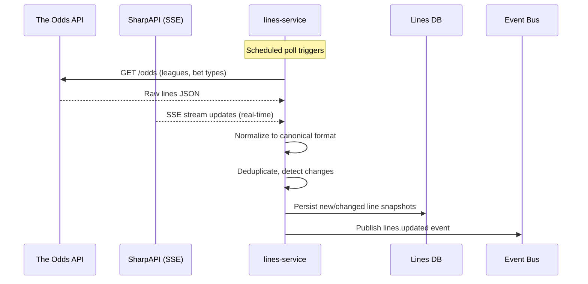
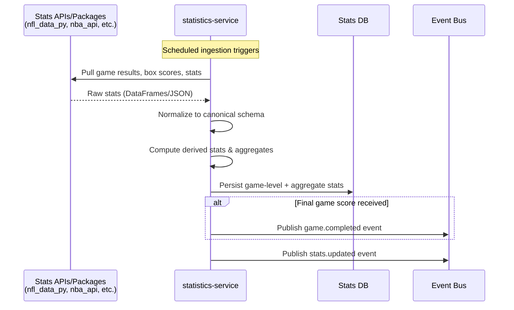
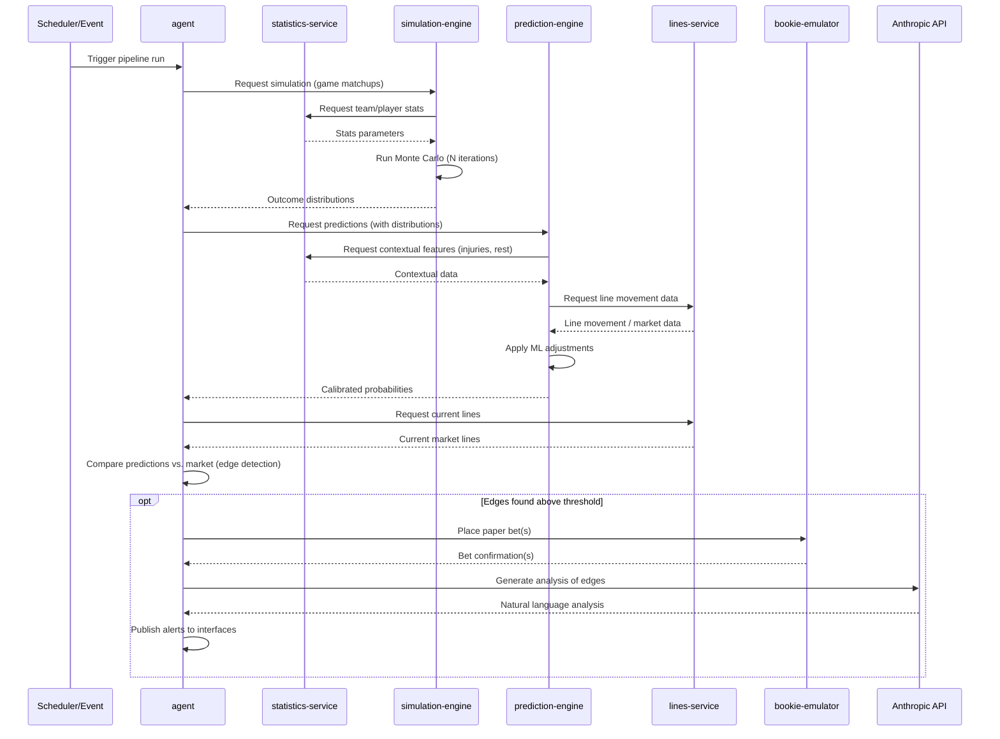
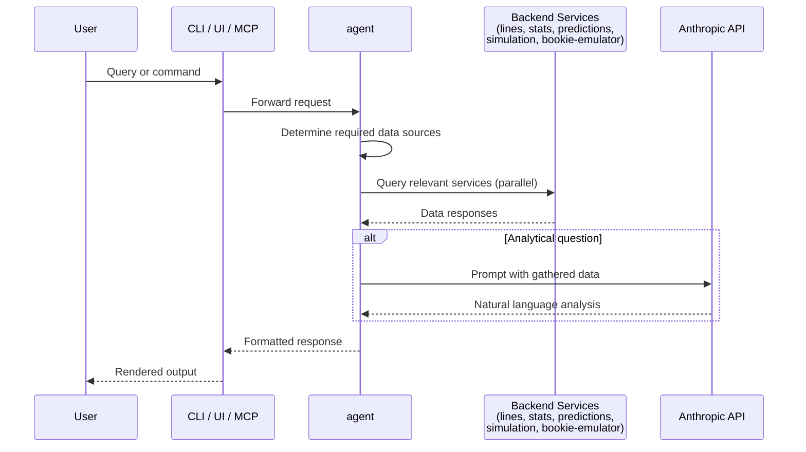
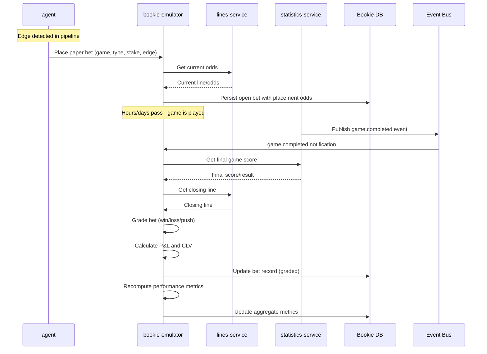

# Data Flow Architecture

This document traces the five critical data paths through BookieBreaker, documenting triggers, transformations, storage points, and latency requirements for each.

---

## Path 1: Lines Ingestion

External odds APIs deliver betting lines into the system, where they are normalized, stored, and made available for edge detection.

### Trigger

- **Scheduled polling** by lines-service (configurable interval, typically every 1-5 minutes during active game windows, less frequently otherwise).
- Primary source: The Odds API (REST polling). Secondary: SharpAPI (SSE streaming for low-latency updates).

### Steps

1. **lines-service polls external APIs** -- Sends requests to The Odds API for current lines across all 6 leagues and supported bet types (spreads, totals, moneylines, player props, team props, futures).
2. **Raw response received** -- JSON payloads containing lines from 40+ sportsbooks, keyed by game, bet type, and book.
3. **Normalization** -- lines-service transforms provider-specific formats into a canonical internal schema. This includes standardizing team names, bet type labels, odds formats (American/decimal/fractional all stored as American + implied probability), and timestamps.
4. **Deduplication and change detection** -- Compare incoming lines against the most recent stored snapshot. Identify new lines, changed lines, and removed lines.
5. **Storage** -- Persist new/changed lines to the lines-service database with timestamps. Every line snapshot is retained for historical line movement tracking.
6. **Notification** -- Publish a `lines.updated` event containing the game IDs and bet types that changed, enabling downstream consumers to react.

### Storage Points

| What                           | Where                               | Retention                 |
| ------------------------------ | ----------------------------------- | ------------------------- |
| Raw API responses              | lines-service cache (short-term)    | 24 hours for debugging    |
| Normalized line snapshots      | lines-service database (PostgreSQL) | Indefinite (full history) |
| Closing lines (final pre-game) | lines-service database, flagged     | Indefinite                |

### Latency Requirements

- **Polling frequency:** 1-5 minutes for standard lines, sub-second for SharpAPI SSE stream.
- **Normalization + storage:** < 2 seconds per poll cycle.
- **End-to-end (API response to event published):** < 5 seconds. Lines data is near-real-time but not latency-critical since BookieBreaker does not do live in-game betting initially.

### Diagram

---

## Path 2: Statistics Ingestion

External statistics sources deliver game results, player stats, and team metrics into the system for use by the simulation and prediction engines.

### Trigger

- **Scheduled polling** by statistics-service (frequency varies: after game completions, daily bulk updates, and seasonal schedule refreshes).
- Different cadences per data type: game results checked every 15-30 minutes during game windows, roster/injury data checked 2-4 times daily, seasonal aggregates recomputed after each game day.

### Steps

1. **statistics-service calls data source packages/APIs** -- Uses sport-specific Python packages (nfl_data_py, nba_api, pybaseball, CFBD API, etc.) to pull raw data.
2. **Raw data received** -- Box scores, play-by-play, player stats, team stats, injury reports, schedules. Format varies by source (DataFrames from Python packages, JSON from APIs).
3. **Normalization** -- Transform source-specific schemas into canonical internal models. Standardize team/player identifiers, stat names, and units across all 6 leagues.
4. **Derived statistics computation** -- Compute rolling averages, per-game rates, advanced metrics (offensive/defensive ratings, pace, efficiency), and other aggregates from raw game-level data.
5. **Storage** -- Persist normalized stats at multiple granularities: game-level, season-level, career-level. Store final game scores separately for bet grading.
6. **Notification** -- Publish `stats.updated` event (with league and data type metadata) and, when final game scores arrive, publish `game.completed` event.

### Storage Points

| What                        | Where                                    | Retention                      |
| --------------------------- | ---------------------------------------- | ------------------------------ |
| Raw source data             | statistics-service cache                 | 48 hours for debugging/replay  |
| Normalized game-level stats | statistics-service database (PostgreSQL) | Indefinite                     |
| Derived/aggregate stats     | statistics-service database              | Recomputed, current kept       |
| Final game scores           | statistics-service database              | Indefinite                     |
| Injury/roster data          | statistics-service database              | Current + historical snapshots |

### Latency Requirements

- **Game results:** Available within 15-30 minutes of game completion (dependent on source update speed).
- **Derived stats recomputation:** < 1 minute after new game data ingested.
- **End-to-end:** Minutes to hours depending on data type. Not real-time.

### Diagram

---

## Path 3: Full Prediction Pipeline

The core analytical pipeline that transforms raw data into actionable betting edges.

### Trigger

- **Scheduled run** orchestrated by the agent (e.g., daily pipeline for upcoming games, or triggered by schedule -- morning run for day's games).
- **Event-driven** when a `stats.updated` or `lines.updated` event indicates material new data is available (agent decides whether to re-run).

### Steps

1. **Agent initiates pipeline** -- Determines which games need predictions (upcoming games, or games with materially changed lines/stats). Sends simulation requests to simulation-engine.
2. **Simulation-engine requests stats** -- For each matchup, simulation-engine calls statistics-service for team/player parameters (offensive/defensive ratings, pace, efficiency, pitcher stats, etc.).
3. **Statistics-service responds** -- Returns normalized team and player stats needed to parameterize the simulation.
4. **Monte Carlo simulation runs** -- Simulation-engine runs N iterations (e.g., 10,000-50,000) of the sport-specific simulation plugin. Produces full outcome distributions: score distributions, margin distributions, total distributions.
5. **Simulation results returned to prediction-engine** -- Raw outcome distributions passed to prediction-engine (via agent orchestration or direct call).
6. **Prediction-engine requests contextual features** -- Calls statistics-service for injury data, rest days, travel distance, seasonal trends. Calls lines-service for line movement patterns and market-implied probabilities.
7. **ML adjustment applied** -- Prediction-engine runs gradient boosting models to adjust simulation distributions for contextual factors. Produces calibrated probabilities for each bet type.
8. **Calibrated predictions returned to agent** -- Agent receives final probabilities with confidence intervals and feature importance.
9. **Edge detection** -- Agent requests current lines from lines-service. Compares calibrated probabilities against market-implied probabilities. Identifies edges (predicted probability significantly exceeds implied probability).
10. **Paper bet placement (optional)** -- For edges meeting threshold criteria, agent sends bet placement request to bookie-emulator with game, bet type, current odds, stake size, predicted probability, and edge size.
11. **Alert generation** -- Agent generates natural language analysis of detected edges using the Anthropic API. Sends alerts to subscribed interfaces (CLI, UI, MCP).

### Storage Points

| What                       | Where                                             | Retention           |
| -------------------------- | ------------------------------------------------- | ------------------- |
| Simulation parameters used | simulation-engine (logged)                        | Per-run, indefinite |
| Outcome distributions      | simulation-engine cache / prediction-engine input | Current run         |
| ML model predictions       | prediction-engine (logged)                        | Per-run, indefinite |
| Detected edges             | agent database / prediction store                 | Indefinite          |
| Paper bets placed          | bookie-emulator database                          | Indefinite          |
| LLM analysis text          | agent database                                    | Indefinite          |

### Latency Requirements

- **Full pipeline (all games for a day):** 5-30 minutes depending on number of games and simulation depth.
- **Single game prediction:** 30 seconds to 2 minutes (simulation is the bottleneck).
- **Edge detection (comparison step):** < 1 second once predictions and lines are available.
- **Alert delivery:** < 30 seconds after edge detected.

### Diagram

---

## Path 4: User Query

A user asks a question or requests data through any of the three interfaces.

### Trigger

- **User action** via CLI command, UI interaction, or MCP tool call.
- Examples: "Why do you like the over in Lakers-Celtics?", "Show me today's edges", "What's my paper trading ROI this month?"

### Steps

1. **Interface receives user input** -- CLI parses command, UI captures form/chat input, MCP server receives tool call.
2. **Request routed to agent** -- All three interfaces call the agent's API with the user's query or command. The agent is the single entry point for analytical questions and pipeline operations.
3. **Agent determines required data** -- Based on the query, agent identifies which services to call. A question about edges needs prediction-engine + lines-service. A performance question needs bookie-emulator. A stats question needs statistics-service.
4. **Agent queries relevant services** -- Makes parallel API calls to the needed services:
   - lines-service for current lines, line movement
   - prediction-engine for predictions, probabilities
   - simulation-engine for distribution data
   - statistics-service for stats, matchup context
   - bookie-emulator for paper trading data
5. **Services respond with data** -- Each service returns its data via API response.
6. **Agent synthesizes response** -- For analytical questions, agent calls Anthropic API with the gathered data as context, generating natural language analysis. For data queries, agent formats the structured data directly.
7. **Response returned to interface** -- Agent sends formatted response back to the calling interface.
8. **Interface renders for user** -- CLI formats as terminal text/tables, UI renders as dashboard/charts, MCP returns as tool result.

### Storage Points

| What                           | Where                         | Retention               |
| ------------------------------ | ----------------------------- | ----------------------- |
| Query/response history         | agent (optional, for context) | Session or configurable |
| No new persistent data created | --                            | --                      |

### Latency Requirements

- **Data queries (lines, stats, performance):** < 2 seconds end-to-end.
- **Analytical questions (requiring LLM):** 3-10 seconds (dominated by LLM response time).
- **User expectation:** Interactive, feels responsive. Sub-second for cached data, a few seconds for analysis.

### Diagram

---

## Path 5: Paper Trade Lifecycle

Tracks a virtual bet from placement through game completion and grading.

### Trigger

- **Edge detected** in the prediction pipeline (Path 3). Agent decides to place a paper bet based on edge size and configured thresholds.

### Steps

1. **Agent sends bet placement request** -- Includes game ID, bet type, predicted probability, edge size, and stake (calculated via Kelly criterion or fixed unit).
2. **Bookie-emulator captures current odds** -- Calls lines-service to get the exact current line/odds at this moment. This is the "placement odds" that the bet is tracked against.
3. **Bet persisted as open** -- Bookie-emulator stores the bet with status "open", recording: game, bet type, side, odds at placement, stake, predicted probability, edge size, timestamp.
4. **Game is played** -- Time passes (hours to days depending on sport/schedule).
5. **Game completes, results available** -- statistics-service ingests the final game score and publishes a `game.completed` event.
6. **Bookie-emulator grades the bet** -- On receiving `game.completed` (or via periodic polling), bookie-emulator calls statistics-service for the final score. Determines win/loss/push against the bet's terms.
7. **Closing line captured** -- Bookie-emulator calls lines-service for the closing line (final line before game start). Computes Closing Line Value (CLV): did the placement odds beat the closing line?
8. **Bet record updated** -- Bet status changed from "open" to "won"/"lost"/"push". P&L calculated. CLV recorded.
9. **Performance metrics recomputed** -- Aggregate metrics updated: ROI, win rate, CLV average, units won/lost, calibration data, breakdowns by sport/league/bet type.
10. **Metrics available** -- Updated performance data available to agent, CLI, UI, MCP for display and analysis.

### Storage Points

| What                                      | Where                                   | Retention                |
| ----------------------------------------- | --------------------------------------- | ------------------------ |
| Open bet record                           | bookie-emulator database                | Until graded             |
| Graded bet record (with result, P&L, CLV) | bookie-emulator database                | Indefinite               |
| Performance aggregates                    | bookie-emulator database (materialized) | Recomputed, current kept |
| Placement odds snapshot                   | bookie-emulator database (per bet)      | Indefinite               |
| Closing line snapshot                     | bookie-emulator database (per bet)      | Indefinite               |

### Latency Requirements

- **Bet placement:** < 2 seconds (must capture odds quickly, though not HFT-level urgency).
- **Bet grading:** Within 30 minutes of game completion (dependent on statistics-service ingestion speed).
- **Metric recomputation:** < 10 seconds after bet graded.
- **Overall lifecycle:** Hours to days (game must complete).

### Diagram

---

## Cross-Path Summary

The five paths interact at well-defined points:

| Path                 | Feeds Into                                                                                           | Fed By                                                             |
| -------------------- | ---------------------------------------------------------------------------------------------------- | ------------------------------------------------------------------ |
| Lines Ingestion      | Prediction Pipeline (current lines for edge detection), Paper Trade (placement + closing odds)       | External APIs                                                      |
| Statistics Ingestion | Prediction Pipeline (simulation params, contextual features), Paper Trade (final scores for grading) | External APIs/packages                                             |
| Prediction Pipeline  | Paper Trade (detected edges trigger bets), User Query (predictions available to query)               | Lines + Statistics ingestion                                       |
| User Query           | None (read-only)                                                                                     | All other paths (reads their stored outputs)                       |
| Paper Trade          | None (self-contained after placement)                                                                | Prediction Pipeline (triggers), Lines + Statistics (odds + scores) |
