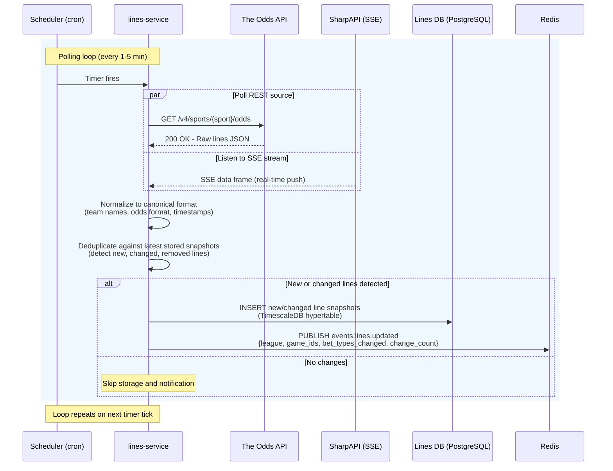
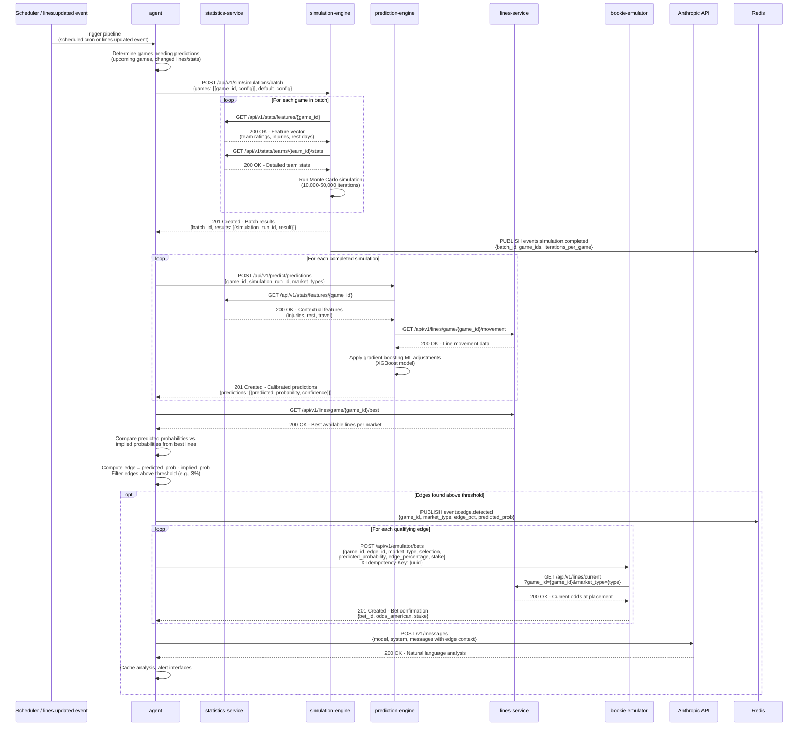
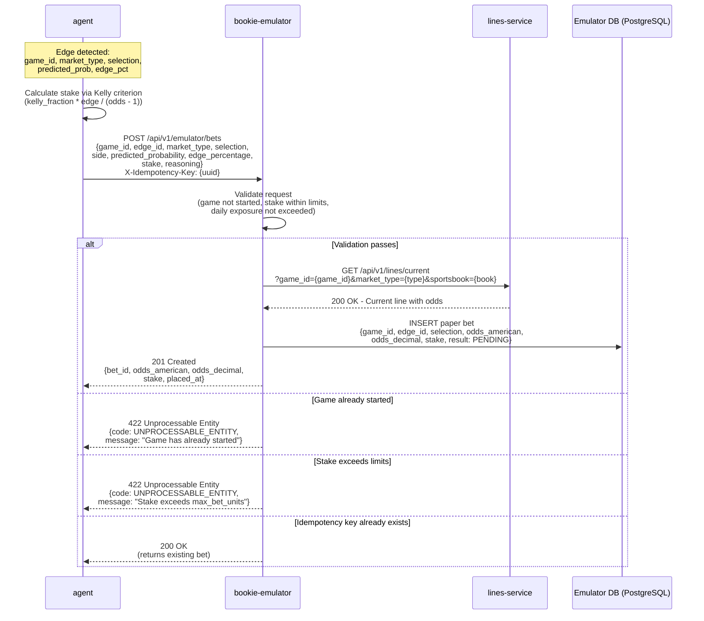
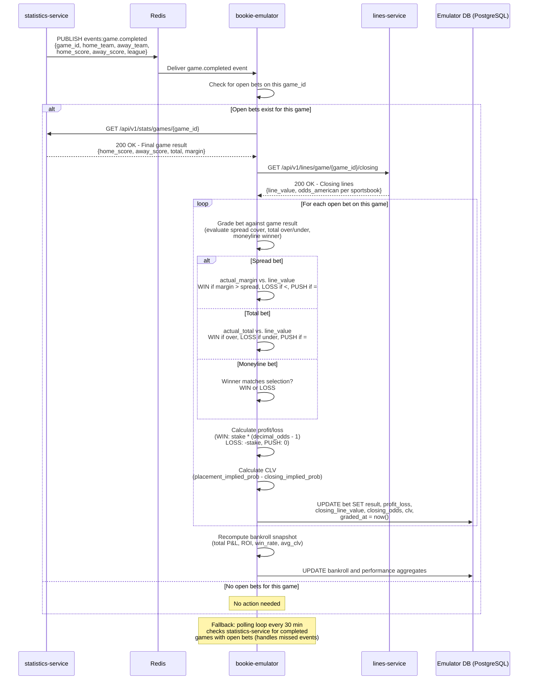
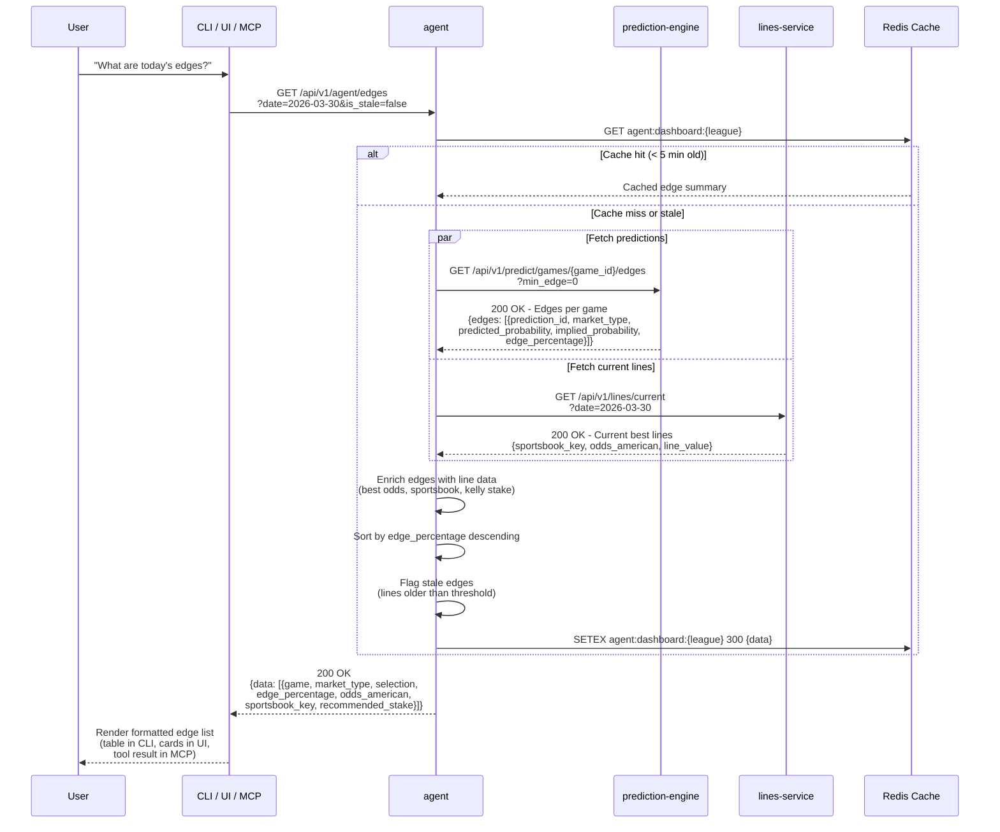
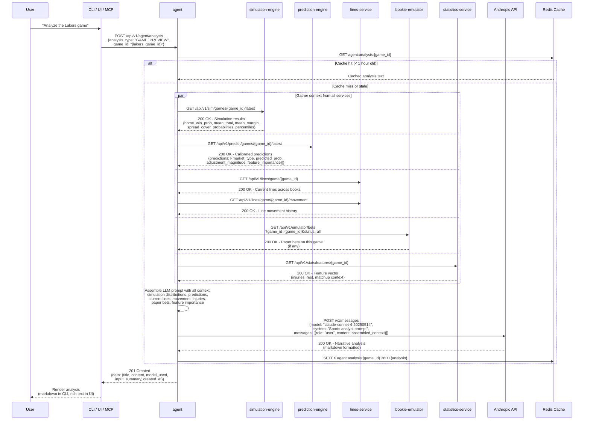
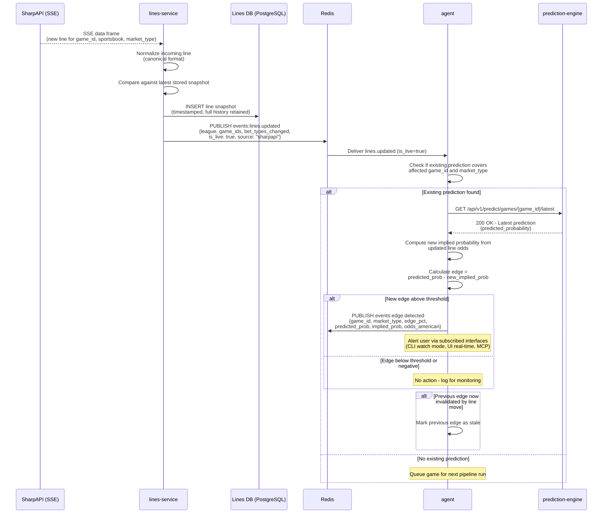
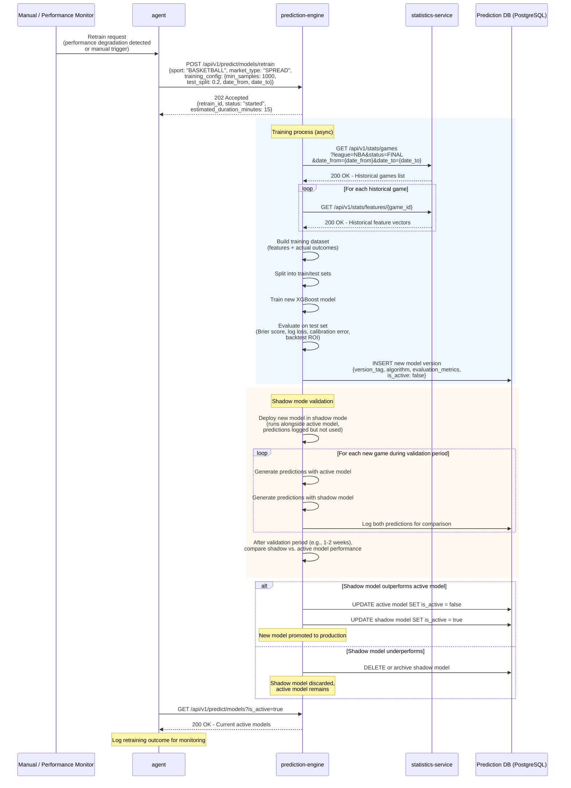

# Sequence Diagrams

Detailed Mermaid sequence diagrams for the 8 critical flows in BookieBreaker. Each diagram shows participants, HTTP calls with method and path, Redis pub/sub events, and conditional logic via alt/opt blocks.

For API conventions and endpoint details, see [API Design Principles](../api-contracts/README.md) and individual service API contracts.

---

## 1. Scheduled Lines Ingestion

Lines-service polls external odds APIs on a configurable schedule (1-5 minutes during game windows), normalizes data, stores snapshots, and publishes change notifications.

---

## 2. Full Prediction Pipeline

The agent orchestrates the complete prediction pipeline: simulation, ML adjustment, edge detection, and optional paper bet placement.

---

## 3. Paper Bet Placement

When the agent detects an edge that meets threshold criteria, it places a paper (virtual) bet through the bookie-emulator.

---

## 4. Paper Bet Grading

After a game completes, bookie-emulator grades open paper bets by comparing the game result against the bet terms and computes Closing Line Value.

---

## 5. User Query: "What are today's edges?"

A user requests current edges through any interface. The agent queries prediction-engine and lines-service to return an enriched edge list.

---

## 6. User Query: "Analyze the Lakers game"

A user requests a deep analysis of a specific game. The agent gathers data from multiple services and uses the Anthropic LLM API to generate a narrative.

---

## 7. Live Line Update

When SharpAPI pushes a real-time line update, lines-service stores it and the agent checks whether the new line creates or invalidates an edge.

---

## 8. Model Retraining

Triggered manually or when performance metrics indicate degradation. A new model version is trained, validated in shadow mode, then promoted or discarded.

