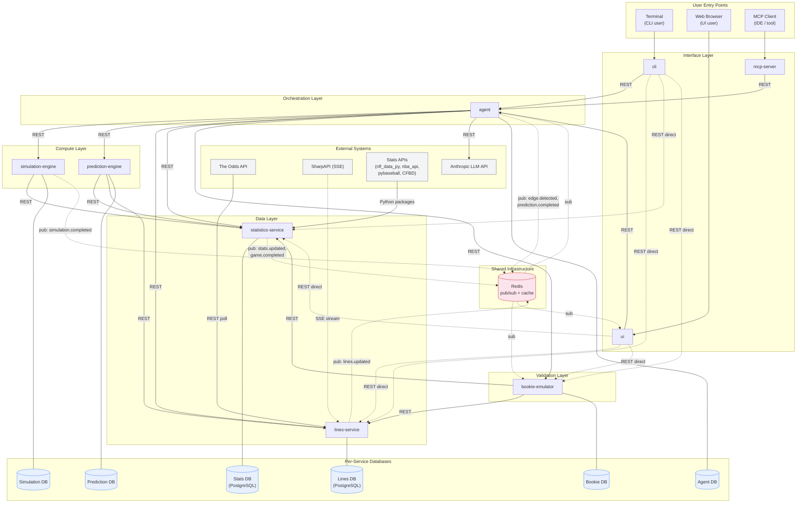

# System Architecture Overview

BookieBreaker is a distributed sports betting analysis platform that detects positive expected value (+EV) edges by combining Monte Carlo simulations, machine learning calibration, and LLM-powered analysis. The system ingests real-time betting lines and historical statistics across six leagues (NFL, NBA, MLB, NHL, NCAAF, NCAAB), runs thousands of game simulations, compares calibrated predictions against market odds, and validates its edge detection through paper trading.

The architecture follows a service-oriented design with 10 independently deployable components, each owning its own data store. Services communicate synchronously via REST for pipeline orchestration and user queries, and asynchronously via Redis pub/sub for event-driven notifications. An LLM-powered agent serves as the orchestration hub, coordinating the prediction pipeline and acting as the gateway for analytical queries from all three user interfaces.

For detailed data path documentation, see [Data Flow Architecture](data-flow.md). For communication protocol specifics, see [Communication Patterns](communication-patterns.md).

---

## High-Level Architecture Diagram

**Legend:**
- **Solid arrows** -- synchronous REST calls (request/response).
- **Dashed arrows** -- asynchronous events via Redis pub/sub, or optional direct-access REST from interfaces.
- **Double-line connectors** -- database ownership (each service owns its store).

---

## Component Groupings

### Data Layer: lines-service, statistics-service

The data layer is responsible for ingesting, normalizing, and serving external data. These services are the system's only contact points with third-party data sources.

- **lines-service** polls The Odds API and receives SharpAPI SSE streams to ingest betting lines from 40+ sportsbooks. It normalizes odds formats, deduplicates updates, retains full line movement history, and publishes `lines.updated` events. Other services query it for current market odds, closing lines, and historical line movement.

- **statistics-service** pulls game results, box scores, player stats, injury reports, and schedules from sport-specific Python packages (nfl_data_py, nba_api, pybaseball, CFBD). It normalizes cross-league schemas, computes derived statistics (rolling averages, advanced metrics), and publishes `stats.updated` and `game.completed` events. It serves as the statistical backbone for simulations, ML features, and LLM context.

### Compute Layer: simulation-engine, prediction-engine

The compute layer transforms raw data into calibrated predictions.

- **simulation-engine** runs Monte Carlo simulations (10,000-50,000 iterations per matchup) using sport-specific plugins. It requests team and player parameters from statistics-service, produces full outcome distributions (scores, margins, totals), and returns results to the agent for downstream processing.

- **prediction-engine** applies gradient boosting models to adjust simulation distributions for contextual factors (injuries, rest days, travel, home/away splits, line movement patterns). It pulls features from both statistics-service and lines-service, producing calibrated probabilities with confidence intervals for each bet type.

### Orchestration Layer: agent

The agent is the central coordinator. It serves two roles:

1. **Pipeline orchestrator** -- Runs the prediction pipeline on schedule or in response to events. Sequences calls to simulation-engine, prediction-engine, and lines-service. Performs edge detection by comparing calibrated probabilities against market-implied probabilities. Places paper bets through bookie-emulator when edges exceed configured thresholds. Generates natural language analysis via the Anthropic LLM API.

2. **Query gateway** -- All three user interfaces route analytical questions through the agent. It determines which backend services to query, gathers data in parallel, optionally invokes the LLM for synthesis, and returns formatted responses.

### Interface Layer: cli, ui, mcp-server

The interface layer provides three access points for users, all backed by the same agent and services.

- **cli** -- Terminal-based interface for running pipeline commands, querying edges, and reviewing performance. Suitable for automation and scripting.

- **ui** -- Web-based dashboard for visualizing edges, line movement charts, simulation distributions, and paper trading performance. Subscribes to Redis events for real-time updates.

- **mcp-server** -- Exposes BookieBreaker capabilities as MCP (Model Context Protocol) tools, allowing IDE assistants and other MCP-compatible clients to query predictions, edges, and stats programmatically.

All three interfaces can call backend services directly for simple data lookups (current lines, raw stats, paper trading records) without routing through the agent.

### Validation Layer: bookie-emulator

The bookie-emulator operates as a paper trading system that validates the prediction pipeline's real-world effectiveness. It captures placement odds at bet time, grades bets against final scores from statistics-service, computes Closing Line Value (CLV), and maintains aggregate performance metrics (ROI, win rate, calibration). It subscribes to `game.completed` events for automated bet grading and also polls as a fallback.

### Infrastructure: infra-ops

infra-ops is not a runtime service. It contains Docker Compose configurations, CI/CD pipeline definitions, shared environment templates, and deployment scripts. It is the operational glue that defines how all other services are built, configured, and deployed.

### Shared Infrastructure: Redis

A single Redis instance serves two purposes:

1. **Pub/sub event bus** -- Carries asynchronous events (`lines.updated`, `stats.updated`, `game.completed`, `simulation.completed`, `prediction.completed`, `edge.detected`) between services. At-most-once delivery with polling fallbacks for reliability.

2. **Cache layer** -- Short-lived caches for raw API responses, session data, and idempotency keys. Used by multiple services to reduce redundant external API calls and support duplicate event detection.

Each service additionally owns its own database (PostgreSQL for lines-service and statistics-service; database technology per service for others) for persistent storage.

---

## Deployment Topology

```mermaid
graph TB
    subgraph docker_network ["Docker Network: bookiebreaker"]

        subgraph containers ["Application Containers"]
            agent_c["agent<br/>:8006"]
            ls_c["lines-service<br/>:8001"]
            ss_c["statistics-service<br/>:8002"]
            sim_c["simulation-engine<br/>:8003"]
            pe_c["prediction-engine<br/>:8004"]
            be_c["bookie-emulator<br/>:8005"]
            cli_c["cli<br/>(ephemeral)"]
            ui_c["ui<br/>:3000"]
            mcp_c["mcp-server<br/>:8007"]
        end

        subgraph databases ["Per-Service Databases"]
            lines_db[("lines-db<br/>PostgreSQL<br/>:5432")]
            stats_db[("stats-db<br/>PostgreSQL<br/>:5433")]
            sim_db[("simulation-db<br/>:5434")]
            pred_db[("prediction-db<br/>:5435")]
            agent_db[("agent-db<br/>:5436")]
            bookie_db[("bookie-db<br/>:5437")]
        end

        subgraph shared_infra ["Shared Infrastructure"]
            redis_c[("Redis<br/>:6379")]
        end

        %% Service to database ownership
        agent_c --- agent_db
        ls_c --- lines_db
        ss_c --- stats_db
        sim_c --- sim_db
        pe_c --- pred_db
        be_c --- bookie_db

        %% All services connect to Redis
        agent_c -.-> redis_c
        ls_c -.-> redis_c
        ss_c -.-> redis_c
        sim_c -.-> redis_c
        pe_c -.-> redis_c
        be_c -.-> redis_c
        ui_c -.-> redis_c
    end

    %% External port mappings
    ext_browser["Browser :3000"] -->|exposed| ui_c
    ext_terminal["Terminal"] -->|docker exec / mount| cli_c
    ext_mcp["MCP Client :8007"] -->|exposed| mcp_c
    ext_agent["Agent API :8006"] -->|exposed| agent_c

    %% External APIs (outbound from Docker network)
    ls_c -->|outbound| ext_odds["The Odds API / SharpAPI"]
    ss_c -->|outbound| ext_stats["Stats APIs"]
    agent_c -->|outbound| ext_llm["Anthropic API"]

    classDef container fill:#dbeafe,stroke:#2563eb
    classDef db fill:#e8f0fe,stroke:#4285f4
    classDef redis fill:#fce4ec,stroke:#c62828
    classDef external fill:#f3f4f6,stroke:#6b7280

    class agent_c,ls_c,ss_c,sim_c,pe_c,be_c,cli_c,ui_c,mcp_c container
    class lines_db,stats_db,sim_db,pred_db,agent_db,bookie_db db
    class redis_c redis
    class ext_browser,ext_terminal,ext_mcp,ext_agent,ext_odds,ext_stats,ext_llm external
```

### Container details

| Container | Port | Persistent Volume | Notes |
|-----------|------|-------------------|-------|
| agent | 8006 | agent-db volume | Exposed externally for API access |
| lines-service | 8001 | lines-db volume | Internal; outbound to Odds API / SharpAPI |
| statistics-service | 8002 | stats-db volume | Internal; outbound to stats packages/APIs |
| simulation-engine | 8003 | simulation-db volume | Internal; CPU-intensive workloads |
| prediction-engine | 8004 | prediction-db volume | Internal; ML model files mounted as volume |
| bookie-emulator | 8005 | bookie-db volume | Internal |
| cli | -- | -- | Ephemeral container; runs commands then exits |
| ui | 3000 | -- | Exposed externally for browser access |
| mcp-server | 8007 | -- | Exposed externally for MCP clients |
| Redis | 6379 | redis-data volume | Shared; pub/sub + cache |
| Per-service DBs | 5432-5437 | Named volumes | Internal only; one PostgreSQL instance per service |

### Network topology

- All containers join a single Docker Compose bridge network (`bookiebreaker`). Services resolve each other by container name via Docker's embedded DNS (e.g., `http://lines-service:8001`).
- Only the **ui** (port 3000), **mcp-server** (port 8007), and **agent** (port 8006) expose ports to the host for external access.
- Database containers are internal-only; no host port mappings by default.
- Outbound internet access is required for lines-service (odds APIs), statistics-service (stats APIs), and agent (Anthropic API).

---

## Technology Constraints

### Containerization

All services are containerized with Docker and orchestrated via Docker Compose for development and single-host deployment. Each service has its own Dockerfile. Kubernetes is an optional future path for production scaling but is not required for the initial solo-developer deployment.

### Communication: REST + Redis pub/sub

- **Synchronous (REST):** All pipeline orchestration, user queries, and service-to-service data lookups use JSON REST APIs with a standard response envelope. The agent sequences pipeline steps synchronously because each step depends on the previous result. Timeouts are tuned per call type (5 seconds for data lookups, 5 minutes for simulations, 30 seconds for LLM calls).

- **Asynchronous (Redis pub/sub):** Event notifications for data ingestion completions, game results, and edge alerts use Redis pub/sub channels (e.g., `events:lines.updated`, `events:game.completed`). This decouples producers from consumers and supports broadcast to multiple subscribers. At-most-once delivery is acceptable because all event-driven flows have polling fallbacks.

- **Why not Kafka/RabbitMQ:** Over-engineered for this scale. BookieBreaker publishes at most a few hundred events per hour. Redis is already present for caching, so pub/sub adds zero infrastructure. If durable replay becomes necessary, Redis Streams or NATS JetStream are the planned migration targets.

### Agent as the analytical gateway

The agent is the single entry point for all analytical queries and pipeline operations. CLI, UI, and MCP server route questions through the agent, which determines which backend services to query, gathers data, optionally invokes the LLM, and returns synthesized responses. Interfaces may bypass the agent only for simple, direct data lookups (e.g., fetching current lines from lines-service).

### Each service owns its data store

No shared databases. Each service manages its own schema, migrations, and data lifecycle. Cross-service data access happens exclusively through REST APIs. This enables independent deployment, independent schema evolution, and clear data ownership boundaries.

### Service discovery

Docker Compose DNS handles service resolution. Service URLs are configured via environment variables (e.g., `LINES_SERVICE_URL=http://lines-service:8001`). No external service registry (Consul, etcd) is needed for single-host deployment.

### Authentication

No authentication initially; all services communicate on an internal Docker network. When external access is needed, a shared API key or JWT validation middleware will be added to each service, potentially fronted by a reverse proxy (Caddy or nginx).
