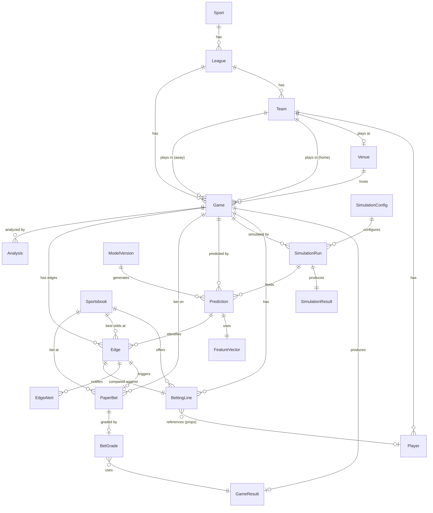

# Domain Models

Conceptual domain model for BookieBreaker -- the shared vocabulary across all services. These are logical entities and their relationships, not database schemas. Each entity defines what the concept means, what attributes it carries, and which service is the authoritative source of truth.

---

## ID Strategy

All entities use **UUID v4** as their primary identifier (`id` field). UUIDs are generated by the source-of-truth service at creation time and are globally unique across the system.

**Exceptions -- composite natural keys used alongside UUIDs:**

- **BettingLine** uses a composite natural key of `(game_id, sportsbook_id, market_type, selection, timestamp)` for deduplication during ingestion. The UUID is still the primary identifier for cross-service references.
- **Game** supplements its UUID with an `external_id` map (keyed by source) for reconciliation across data providers (e.g., The Odds API game key, ESPN game ID).
- **Player** and **Team** carry `external_ids` maps for the same reason -- different stats sources use different identifiers.

**Cross-service references** always use UUIDs. When service A stores a reference to an entity owned by service B, it stores the UUID. Services never store another service's internal database row IDs.

---

## Enum Definitions

All enums are transmitted as uppercase strings over the wire. Services validate against these allowed values.

### Sport

```
FOOTBALL
BASKETBALL
BASEBALL
```

### League

```
NFL           -- National Football League
NBA           -- National Basketball Association
MLB           -- Major League Baseball
NCAA_FB       -- NCAA Division I Football (FBS)
NCAA_BB       -- NCAA Division I Basketball
NCAA_BSB      -- NCAA Division I Baseball
```

### SeasonType

```
PRESEASON
REGULAR
POSTSEASON
OFFSEASON
```

### GameStatus

```
SCHEDULED     -- game is on the schedule, not yet started
IN_PROGRESS   -- game is currently being played
FINAL         -- game has completed with a final score
POSTPONED     -- game delayed to a future date
CANCELLED     -- game will not be played
SUSPENDED     -- game started but halted, to be resumed later
```

### BettingMarketType

```
SPREAD        -- point spread / handicap
TOTAL         -- over/under on combined score
MONEYLINE     -- straight-up winner
PLAYER_PROP   -- proposition bet on a player stat line
TEAM_PROP     -- proposition bet on a team stat line
GAME_PROP     -- proposition bet on a game event
FUTURE        -- futures / outrights (e.g., conference winner)
LIVE          -- in-game / live betting line
```

### OddsFormat

```
AMERICAN      -- e.g., -110, +150
DECIMAL       -- e.g., 1.91, 2.50
```

### BetResult

```
WIN
LOSS
PUSH
PENDING       -- game not yet completed
CANCELLED     -- bet voided (e.g., player inactive for prop)
```

### BetSide

```
HOME
AWAY
OVER
UNDER
YES
NO
```

### PlayerStatus

```
ACTIVE
INJURED        -- on injury report but may play
OUT            -- ruled out / injured reserve
SUSPENDED
INACTIVE       -- healthy scratch or not on active roster
```

### AlertPriority

```
HIGH           -- large edge, time-sensitive
MEDIUM         -- moderate edge
LOW            -- informational
```

### AlertChannel

```
CLI
UI
MCP
```

### AnalysisType

```
GAME_PREVIEW   -- pre-game analysis
EDGE_BREAKDOWN -- explanation of a detected edge
PERFORMANCE_REVIEW -- review of paper trading performance
```

---

## Entity Definitions

### Reference Data

#### Sport

A top-level sport category that groups leagues.

| Attribute    | Type         | Description                            |
| ------------ | ------------ | -------------------------------------- |
| id           | UUID         | Primary identifier                     |
| name         | Sport (enum) | Sport name                             |
| display_name | string       | Human-readable name (e.g., "Football") |

**Relationships:**

- One Sport has many Leagues.

**Source of truth:** statistics-service

**Notes:** The system supports exactly three sports. This entity exists primarily to group leagues and drive sport-specific simulation plugin selection.

---

#### League

A professional or collegiate league within a sport. Carries metadata about its season structure.

| Attribute            | Type              | Description                                            |
| -------------------- | ----------------- | ------------------------------------------------------ |
| id                   | UUID              | Primary identifier                                     |
| sport_id             | UUID              | FK to Sport                                            |
| name                 | League (enum)     | League identifier                                      |
| display_name         | string            | Human-readable name (e.g., "National Football League") |
| abbreviation         | string            | Short label (e.g., "NFL")                              |
| season_type          | SeasonType (enum) | Current season phase                                   |
| current_season       | int               | Current season year (e.g., 2026)                       |
| regular_season_games | int               | Number of regular season games per team                |
| season_start_month   | int               | Month the regular season typically starts (1-12)       |
| season_end_month     | int               | Month the regular season typically ends (1-12)         |
| has_playoffs         | boolean           | Whether the league has a postseason tournament         |

**Relationships:**

- One League belongs to one Sport.
- One League has many Teams.
- One League has many Games.

**Source of truth:** statistics-service

**Notes:** Season metadata is used by the agent to determine polling schedules (no need to poll for NFL lines in April) and by the simulation-engine to select the correct sport plugin.

**League details:**

| League   | Sport      | Regular Season Games | Season Months |
| -------- | ---------- | -------------------- | ------------- |
| NFL      | FOOTBALL   | 17                   | Sep -- Jan    |
| NBA      | BASKETBALL | 82                   | Oct -- Apr    |
| MLB      | BASEBALL   | 162                  | Mar -- Sep    |
| NCAA_FB  | FOOTBALL   | 12-15                | Aug -- Jan    |
| NCAA_BB  | BASKETBALL | 30-35                | Nov -- Apr    |
| NCAA_BSB | BASEBALL   | 56                   | Feb -- Jun    |

---

#### Team

A team within a league.

| Attribute    | Type                | Description                                                         |
| ------------ | ------------------- | ------------------------------------------------------------------- |
| id           | UUID                | Primary identifier                                                  |
| league_id    | UUID                | FK to League                                                        |
| name         | string              | Full team name (e.g., "Kansas City Chiefs")                         |
| abbreviation | string              | Short code (e.g., "KC")                                             |
| location     | string              | City or region (e.g., "Kansas City")                                |
| mascot       | string              | Mascot or nickname (e.g., "Chiefs")                                 |
| venue_id     | UUID                | FK to primary home Venue                                            |
| conference   | string              | nullable -- conference name (e.g., "AFC", "Eastern", "Big 12")      |
| division     | string              | nullable -- division name (e.g., "AFC West", "Atlantic")            |
| external_ids | map<string, string> | Source-specific IDs (e.g., {"espn": "12", "odds_api": "kc-chiefs"}) |
| active       | boolean             | Whether the team is currently active in the league                  |

**Relationships:**

- One Team belongs to one League.
- One Team has many Players.
- One Team has one primary Venue (home venue).
- One Team participates in many Games (as home or away).

**Source of truth:** statistics-service

**Notes:** Team abbreviations must be consistent across the system. The statistics-service maintains a canonical abbreviation mapping from each external source's team identifiers. `external_ids` enables reconciliation across providers that use different team keys.

---

#### Player

An individual player on a team roster.

| Attribute          | Type                | Description                                               |
| ------------------ | ------------------- | --------------------------------------------------------- |
| id                 | UUID                | Primary identifier                                        |
| team_id            | UUID                | FK to Team (current team)                                 |
| first_name         | string              | Player first name                                         |
| last_name          | string              | Player last name                                          |
| position           | string              | Primary position (sport-specific, e.g., "QB", "PG", "SP") |
| jersey_number      | int                 | nullable -- uniform number                                |
| status             | PlayerStatus (enum) | Current availability status                               |
| injury_description | string              | nullable -- nature of injury if applicable                |
| birth_date         | datetime            | nullable -- date of birth                                 |
| experience_years   | int                 | nullable -- years of professional experience              |
| external_ids       | map<string, string> | Source-specific IDs                                       |

**Relationships:**

- One Player belongs to one Team (current).
- One Player is associated with many Games (via game statistics, not modeled here).

**Source of truth:** statistics-service

**Notes:** Player status is critical for the prediction-engine's injury adjustment models. Status should be updated at least twice daily during active seasons. Historical team associations (trades, free agency) are tracked by the statistics-service internally but the domain model represents current state only.

---

#### Venue

A stadium or arena where games are played.

| Attribute           | Type    | Description                                                     |
| ------------------- | ------- | --------------------------------------------------------------- |
| id                  | UUID    | Primary identifier                                              |
| name                | string  | Venue name (e.g., "Arrowhead Stadium")                          |
| city                | string  | City                                                            |
| state               | string  | State or province                                               |
| country             | string  | Country (default "US")                                          |
| latitude            | float   | Geographic latitude                                             |
| longitude           | float   | Geographic longitude                                            |
| surface_type        | string  | nullable -- playing surface (e.g., "grass", "turf", "hardwood") |
| is_dome             | boolean | Whether the venue is enclosed/domed                             |
| is_retractable_roof | boolean | Whether the roof can open/close                                 |
| capacity            | int     | Seating capacity                                                |
| elevation_ft        | int     | nullable -- elevation above sea level in feet                   |

**Relationships:**

- One Venue is the home venue for one or more Teams.
- One Venue hosts many Games.

**Source of truth:** statistics-service

**Notes:** Venue attributes feed into the prediction-engine's contextual models. `is_dome` affects weather relevance for football/baseball. `surface_type` may impact injury risk and playing style. `elevation_ft` is relevant for baseball (ball carries farther at altitude, e.g., Coors Field). `latitude`/`longitude` enable travel distance calculations for rest/travel features.

---

### Game Data

#### Game

A scheduled, in-progress, or completed game between two teams.

| Attribute       | Type                | Description                                         |
| --------------- | ------------------- | --------------------------------------------------- |
| id              | UUID                | Primary identifier                                  |
| league_id       | UUID                | FK to League                                        |
| home_team_id    | UUID                | FK to Team                                          |
| away_team_id    | UUID                | FK to Team                                          |
| venue_id        | UUID                | FK to Venue                                         |
| scheduled_start | datetime            | Scheduled game start time (UTC)                     |
| status          | GameStatus (enum)   | Current game status                                 |
| season          | int                 | Season year                                         |
| season_type     | SeasonType (enum)   | Regular season, postseason, etc.                    |
| week            | int                 | nullable -- week number (football) or day of season |
| external_ids    | map<string, string> | Source-specific game IDs for reconciliation         |
| neutral_site    | boolean             | Whether the game is at a neutral venue              |
| home_score      | int                 | nullable -- current or final home team score        |
| away_score      | int                 | nullable -- current or final away team score        |

**Relationships:**

- One Game belongs to one League.
- One Game involves two Teams (home and away).
- One Game is played at one Venue.
- One Game has zero or one GameResult (when completed).
- One Game has many BettingLines.
- One Game has many SimulationRuns.
- One Game has many Predictions.
- One Game has many PaperBets.

**Source of truth:** statistics-service

**Notes:** `home_score` and `away_score` are populated during and after the game. They are nullable for scheduled games. The `external_ids` map is essential because different data sources (The Odds API, nfl_data_py, nba_api, ESPN) use different game identifiers and must be reconciled to a single canonical UUID.

---

#### GameResult

Detailed final result of a completed game, including summary statistics.

| Attribute     | Type      | Description                                                                    |
| ------------- | --------- | ------------------------------------------------------------------------------ |
| id            | UUID      | Primary identifier                                                             |
| game_id       | UUID      | FK to Game                                                                     |
| home_score    | int       | Final home team score                                                          |
| away_score    | int       | Final away team score                                                          |
| total_score   | int       | Combined score (home + away)                                                   |
| margin        | int       | Score margin (home - away, positive = home win)                                |
| period_scores | list<map> | Score by period/quarter/inning (e.g., [{"period": 1, "home": 28, "away": 24}]) |
| overtime      | boolean   | Whether the game went to overtime/extra innings                                |
| completed_at  | datetime  | When the game officially ended                                                 |

**Relationships:**

- One GameResult belongs to one Game.

**Source of truth:** statistics-service

**Notes:** The `game.completed` event includes `game_id`, `home_score`, and `away_score`. The bookie-emulator uses this to grade bets. The full `GameResult` with period scores is available via API for detailed analysis. `margin` and `total_score` are denormalized for convenience since they are the two most common values needed for bet grading (spread and total bets respectively).

---

### Betting Data

#### Sportsbook

A bookmaker / sportsbook that offers betting lines.

| Attribute | Type    | Description                                                |
| --------- | ------- | ---------------------------------------------------------- |
| id        | UUID    | Primary identifier                                         |
| name      | string  | Canonical name (e.g., "DraftKings")                        |
| key       | string  | Unique short key used in APIs (e.g., "draftkings")         |
| is_sharp  | boolean | Whether this book is considered a sharp/market-making book |
| is_active | boolean | Whether we are currently tracking this book                |

**Relationships:**

- One Sportsbook has many BettingLines.

**Source of truth:** lines-service

**Notes:** The `is_sharp` flag identifies market-making books (e.g., Pinnacle, Circa) whose lines are treated as more efficient. This influences CLV calculations and may be used as a feature in the prediction-engine. The system tracks lines from 40+ sportsbooks per The Odds API.

---

#### BettingLine

A specific betting line offered by a specific sportsbook for a specific game at a specific point in time. This is the atomic unit of betting data.

| Attribute           | Type                     | Description                                                                                   |
| ------------------- | ------------------------ | --------------------------------------------------------------------------------------------- |
| id                  | UUID                     | Primary identifier                                                                            |
| game_id             | UUID                     | FK to Game                                                                                    |
| sportsbook_id       | UUID                     | FK to Sportsbook                                                                              |
| market_type         | BettingMarketType (enum) | Type of bet                                                                                   |
| selection           | string                   | What is being bet on (e.g., "KC -3.5", "Over 47.5", "KC ML", "P.Mahomes Over 285.5 Pass Yds") |
| side                | BetSide (enum)           | nullable -- which side (HOME, AWAY, OVER, UNDER, etc.)                                        |
| line_value          | float                    | nullable -- the spread or total number (e.g., -3.5, 47.5, 285.5). Null for moneylines.        |
| odds_american       | int                      | American odds (e.g., -110, +150)                                                              |
| odds_decimal        | float                    | Decimal odds (e.g., 1.91, 2.50)                                                               |
| implied_probability | float                    | Implied probability derived from odds (before vig removal)                                    |
| timestamp           | datetime                 | When this line snapshot was captured                                                          |
| is_opening          | boolean                  | Whether this is the opening line                                                              |
| is_closing          | boolean                  | Whether this is the closing line (final before game start)                                    |
| player_id           | UUID                     | nullable -- FK to Player (for player props)                                                   |
| stat_type           | string                   | nullable -- stat category for props (e.g., "passing_yards", "rebounds")                       |

**Relationships:**

- One BettingLine belongs to one Game.
- One BettingLine belongs to one Sportsbook.
- One BettingLine optionally references one Player (for player props).

**Source of truth:** lines-service

**Notes:**

- Every line snapshot is stored immutably. Lines are never updated in place -- a new BettingLine record is created each time the line changes. This creates the full line movement history.
- `implied_probability` is calculated as: for negative odds, `|odds| / (|odds| + 100)`; for positive odds, `100 / (odds + 100)`. This includes the vig and is not a true probability.
- `odds_american` is the canonical format stored. `odds_decimal` is denormalized for convenience.
- The `selection` field is a human-readable string that describes the full bet in a standardized format.
- For **spread** bets: `line_value` is the spread (negative = favorite), `side` indicates HOME or AWAY.
- For **total** bets: `line_value` is the total number, `side` indicates OVER or UNDER.
- For **moneyline** bets: `line_value` is null, `side` indicates HOME or AWAY.
- For **player props**: `player_id` and `stat_type` are populated, `line_value` is the prop number.

---

#### LineMovement

An aggregated view of how a specific betting line has moved over time for a specific game, market, and sportsbook. This is a derived/computed entity, not a raw storage entity.

| Attribute           | Type                     | Description                                              |
| ------------------- | ------------------------ | -------------------------------------------------------- |
| game_id             | UUID                     | FK to Game                                               |
| sportsbook_id       | UUID                     | FK to Sportsbook                                         |
| market_type         | BettingMarketType (enum) | Type of bet                                              |
| selection           | string                   | What is being bet on                                     |
| opening_line        | float                    | nullable -- first line value posted                      |
| opening_odds        | int                      | First odds posted (American)                             |
| current_line        | float                    | nullable -- most recent line value                       |
| current_odds        | int                      | Most recent odds (American)                              |
| closing_line        | float                    | nullable -- final line value before game start           |
| closing_odds        | int                      | nullable -- final odds before game start                 |
| line_snapshots      | list<BettingLine>        | Ordered list of all snapshots from open to current/close |
| total_movement      | float                    | Net change from opening to current line value            |
| is_reverse_movement | boolean                  | Whether the line has moved back toward its opening value |

**Relationships:**

- Derived from multiple BettingLine records for the same game/sportsbook/market.

**Source of truth:** lines-service (computed on read from BettingLine history)

**Notes:** LineMovement is not stored as its own record. It is assembled by the lines-service API from the ordered sequence of BettingLine snapshots for a given game + sportsbook + market combination. The prediction-engine uses line movement patterns as a feature (sharp money indicators). `is_reverse_movement` flags lines that opened, moved in one direction, then came back -- often a signal of overreaction.

---

### Simulation Data

#### SimulationConfig

Parameters that define how a simulation should be run.

| Attribute             | Type             | Description                                                                                              |
| --------------------- | ---------------- | -------------------------------------------------------------------------------------------------------- |
| id                    | UUID             | Primary identifier                                                                                       |
| sport                 | Sport (enum)     | Which sport plugin to use                                                                                |
| iterations            | int              | Number of Monte Carlo iterations (e.g., 10000, 50000)                                                    |
| convergence_threshold | float            | nullable -- stop early if distributions converge within this tolerance                                   |
| random_seed           | int              | nullable -- seed for reproducibility (null = random)                                                     |
| plugin_config         | map<string, any> | Sport-specific simulation parameters (e.g., {"pace_model": "possession", "include_garbage_time": false}) |

**Relationships:**

- One SimulationConfig is used by many SimulationRuns.

**Source of truth:** simulation-engine

**Notes:** Default configs exist per sport. The agent may override parameters for specific runs (e.g., more iterations for high-stakes games). The `plugin_config` map allows sport-specific parameters without changing the shared schema. Football might include `{"play_level_sim": true}`, basketball might include `{"possessions_per_game": 100}`.

---

#### SimulationRun

Metadata about a completed simulation execution.

| Attribute            | Type     | Description                                                       |
| -------------------- | -------- | ----------------------------------------------------------------- |
| id                   | UUID     | Primary identifier                                                |
| game_id              | UUID     | FK to Game                                                        |
| config_id            | UUID     | FK to SimulationConfig                                            |
| started_at           | datetime | When the simulation started                                       |
| completed_at         | datetime | When the simulation finished                                      |
| duration_ms          | int      | Execution time in milliseconds                                    |
| iterations_completed | int      | Actual iterations run (may differ from config if convergence hit) |
| converged            | boolean  | Whether the simulation converged before reaching max iterations   |
| parameters_hash      | string   | Hash of the input parameters (for cache invalidation)             |
| batch_id             | UUID     | nullable -- groups runs that were triggered together              |

**Relationships:**

- One SimulationRun belongs to one Game.
- One SimulationRun uses one SimulationConfig.
- One SimulationRun produces one SimulationResult.

**Source of truth:** simulation-engine

**Notes:** `parameters_hash` enables the simulation-engine to detect when the same game has already been simulated with the same inputs and return cached results instead of re-running. The agent may force a re-run if stats have been updated since the last simulation.

---

#### SimulationResult

The output distributions from a completed simulation run.

| Attribute                  | Type                         | Description                                                                                  |
| -------------------------- | ---------------------------- | -------------------------------------------------------------------------------------------- |
| id                         | UUID                         | Primary identifier                                                                           |
| simulation_run_id          | UUID                         | FK to SimulationRun                                                                          |
| home_score_distribution    | map<int, float>              | Distribution of home team scores ({score: probability})                                      |
| away_score_distribution    | map<int, float>              | Distribution of away team scores ({score: probability})                                      |
| margin_distribution        | map<int, float>              | Distribution of score margins (home - away)                                                  |
| total_distribution         | map<int, float>              | Distribution of combined scores                                                              |
| home_win_probability       | float                        | P(home wins)                                                                                 |
| away_win_probability       | float                        | P(away wins)                                                                                 |
| draw_probability           | float                        | P(draw) -- relevant for regulation-only markets                                              |
| spread_cover_probabilities | map<float, float>            | P(home covers) at various spread values ({-3.5: 0.52, -7.0: 0.38, ...})                      |
| total_over_probabilities   | map<float, float>            | P(over) at various total values ({44.5: 0.55, 45.5: 0.51, ...})                              |
| mean_home_score            | float                        | Mean of home score distribution                                                              |
| mean_away_score            | float                        | Mean of away score distribution                                                              |
| mean_total                 | float                        | Mean of total distribution                                                                   |
| mean_margin                | float                        | Mean of margin distribution                                                                  |
| percentiles                | map<string, map<int, float>> | Key percentiles for distributions (e.g., {"margin": {10: -8, 25: -3, 50: 2, 75: 7, 90: 13}}) |

**Relationships:**

- One SimulationResult belongs to one SimulationRun.

**Source of truth:** simulation-engine

**Notes:** Distributions are represented as maps from integer values to probabilities. This is dense enough for score-range outcomes (football scores typically 0-60, basketball 70-150, baseball 0-20). The `spread_cover_probabilities` and `total_over_probabilities` maps pre-compute cover/over probabilities at common line values, avoiding repeated CDF calculations downstream. The prediction-engine consumes these as its base input.

---

### Prediction Data

#### Prediction

An ML-adjusted probability for a specific market on a specific game. This is the final calibrated output that gets compared against market lines.

| Attribute              | Type                     | Description                                                   |
| ---------------------- | ------------------------ | ------------------------------------------------------------- |
| id                     | UUID                     | Primary identifier                                            |
| game_id                | UUID                     | FK to Game                                                    |
| model_version_id       | UUID                     | FK to ModelVersion                                            |
| simulation_run_id      | UUID                     | FK to SimulationRun that provided base distributions          |
| market_type            | BettingMarketType (enum) | Type of bet this prediction is for                            |
| selection              | string                   | What is being predicted (e.g., "KC -3.5", "Over 47.5")        |
| predicted_probability  | float                    | Calibrated probability (0.0 to 1.0)                           |
| simulation_probability | float                    | Raw probability from simulation before ML adjustment          |
| adjustment_magnitude   | float                    | Difference between ML-adjusted and raw simulation probability |
| confidence_lower       | float                    | Lower bound of confidence interval                            |
| confidence_upper       | float                    | Upper bound of confidence interval                            |
| feature_importance     | map<string, float>       | Top features and their contribution to this prediction        |
| created_at             | datetime                 | When this prediction was generated                            |

**Relationships:**

- One Prediction belongs to one Game.
- One Prediction uses one ModelVersion.
- One Prediction is derived from one SimulationRun.
- One Prediction references one FeatureVector.
- One Prediction may be part of one or more Edges.

**Source of truth:** prediction-engine

**Notes:** `predicted_probability` is the key output. It must be well-calibrated -- if the model says 55%, the outcome should occur approximately 55% of the time. `adjustment_magnitude` tracks how much the ML layer changed the raw simulation output; large adjustments warrant scrutiny. `feature_importance` enables explainability (e.g., "injury adjustment contributed +3% to the prediction").

---

#### ModelVersion

Metadata about a specific trained model version.

| Attribute          | Type                     | Description                                                                                       |
| ------------------ | ------------------------ | ------------------------------------------------------------------------------------------------- |
| id                 | UUID                     | Primary identifier                                                                                |
| sport              | Sport (enum)             | Which sport this model is trained for                                                             |
| market_type        | BettingMarketType (enum) | Which market type this model handles                                                              |
| version_tag        | string                   | Semantic version or date tag (e.g., "v2.1", "2026-03-15")                                         |
| algorithm          | string                   | Model type (e.g., "xgboost", "lightgbm")                                                          |
| training_date      | datetime                 | When the model was last trained                                                                   |
| training_samples   | int                      | Number of training samples                                                                        |
| evaluation_metrics | map<string, float>       | Metrics on holdout set (e.g., {"brier_score": 0.21, "log_loss": 0.68, "calibration_error": 0.02}) |
| feature_names      | list<string>             | Ordered list of feature names the model expects                                                   |
| is_active          | boolean                  | Whether this is the currently active model for its sport/market                                   |
| notes              | string                   | nullable -- any notes about this version                                                          |

**Relationships:**

- One ModelVersion produces many Predictions.

**Source of truth:** prediction-engine

**Notes:** Only one ModelVersion per sport/market_type combination should have `is_active = true` at any time. When a new model is trained, the old one is deactivated but retained for comparison. `evaluation_metrics` should include at minimum: Brier score, log loss, and calibration error.

---

#### FeatureVector

The set of input features used to generate a specific prediction. Stored for explainability and debugging.

| Attribute               | Type                | Description                                                                                                         |
| ----------------------- | ------------------- | ------------------------------------------------------------------------------------------------------------------- |
| id                      | UUID                | Primary identifier                                                                                                  |
| prediction_id           | UUID                | FK to Prediction                                                                                                    |
| features                | map<string, float>  | Feature name to value mapping (e.g., {"home_rest_days": 3, "away_injury_impact": -2.5, "line_movement_sharp": 1.2}) |
| feature_source_versions | map<string, string> | Which data versions were used (e.g., {"stats": "2026-03-29T18:00:00Z", "lines": "2026-03-30T10:15:00Z"})            |

**Relationships:**

- One FeatureVector belongs to one Prediction.

**Source of truth:** prediction-engine

**Notes:** Stored primarily for post-hoc analysis and debugging. When a prediction is wrong, the FeatureVector shows exactly what the model saw. `feature_source_versions` tracks data freshness -- if a prediction was made with stale injury data, that is visible here.

---

### Edge Detection

#### Edge

An identified betting edge where the system's predicted probability exceeds the market-implied probability by a meaningful amount.

| Attribute             | Type                     | Description                                                           |
| --------------------- | ------------------------ | --------------------------------------------------------------------- |
| id                    | UUID                     | Primary identifier                                                    |
| game_id               | UUID                     | FK to Game                                                            |
| prediction_id         | UUID                     | FK to Prediction                                                      |
| betting_line_id       | UUID                     | FK to BettingLine (the specific market line being compared against)   |
| sportsbook_id         | UUID                     | FK to Sportsbook (best available book for this edge)                  |
| market_type           | BettingMarketType (enum) | Type of bet                                                           |
| selection             | string                   | Human-readable selection (e.g., "KC -3.5")                            |
| predicted_probability | float                    | System's calibrated probability                                       |
| implied_probability   | float                    | Market-implied probability from the book's odds                       |
| edge_percentage       | float                    | Predicted - implied probability (e.g., 0.042 = 4.2% edge)             |
| expected_value        | float                    | Expected value per unit wagered (e.g., +0.08 = +8% EV)                |
| odds_american         | int                      | Best available American odds for this edge                            |
| kelly_fraction        | float                    | Full Kelly criterion recommended bet fraction                         |
| recommended_stake     | float                    | Recommended stake (fractional Kelly, e.g., quarter Kelly)             |
| confidence            | float                    | Prediction confidence (width of confidence interval)                  |
| detected_at           | datetime                 | When the edge was first detected                                      |
| expires_at            | datetime                 | nullable -- when the edge is expected to expire (game start time)     |
| is_stale              | boolean                  | Whether the line has moved since detection (edge may no longer exist) |

**Relationships:**

- One Edge references one Prediction.
- One Edge references one BettingLine.
- One Edge references one Sportsbook.
- One Edge may trigger one PaperBet.
- One Edge may trigger one or more EdgeAlerts.

**Source of truth:** agent

**Notes:**

- `edge_percentage` is the core metric. The agent uses a configurable threshold (e.g., >= 3%) to determine which edges are actionable.
- `kelly_fraction` is calculated as: `(predicted_prob * (odds_decimal - 1) - (1 - predicted_prob)) / (odds_decimal - 1)`. The `recommended_stake` uses a fraction of Kelly (typically 1/4) to reduce variance.
- `is_stale` is set to true when a subsequent lines update shows the line has moved. Stale edges should not trigger new paper bets.
- An edge's `expected_value` is what makes it actionable. EV = `(predicted_probability * payout) - (1 - predicted_probability) * stake`, normalized per unit.

---

#### EdgeAlert

A notification generated when a new edge is detected, delivered to one or more user interfaces.

| Attribute       | Type                 | Description                                                    |
| --------------- | -------------------- | -------------------------------------------------------------- |
| id              | UUID                 | Primary identifier                                             |
| edge_id         | UUID                 | FK to Edge                                                     |
| channel         | AlertChannel (enum)  | Delivery channel                                               |
| priority        | AlertPriority (enum) | Alert priority level                                           |
| title           | string               | Short alert title (e.g., "4.2% edge on KC -3.5 at DraftKings") |
| body            | string               | Detailed alert body with analysis                              |
| delivered_at    | datetime             | nullable -- when the alert was delivered                       |
| acknowledged_at | datetime             | nullable -- when the user acknowledged the alert               |

**Relationships:**

- One EdgeAlert belongs to one Edge.

**Source of truth:** agent

**Notes:** Priority is determined by edge size and time sensitivity. HIGH = edge > 5% and game starts within 2 hours. MEDIUM = edge 3-5%. LOW = informational or game is far out. An edge may generate alerts on multiple channels simultaneously.

---

### Paper Trading

#### PaperBet

A virtual bet placed by the system when an edge is detected. Tracks the bet through grading.

| Attribute             | Type                     | Description                                                              |
| --------------------- | ------------------------ | ------------------------------------------------------------------------ |
| id                    | UUID                     | Primary identifier                                                       |
| edge_id               | UUID                     | FK to Edge that triggered this bet                                       |
| game_id               | UUID                     | FK to Game                                                               |
| sportsbook_id         | UUID                     | FK to Sportsbook                                                         |
| market_type           | BettingMarketType (enum) | Type of bet                                                              |
| selection             | string                   | What was bet on (e.g., "KC -3.5")                                        |
| side                  | BetSide (enum)           | Which side                                                               |
| line_value            | float                    | nullable -- the spread/total/prop number at placement                    |
| odds_american         | int                      | American odds at time of placement                                       |
| odds_decimal          | float                    | Decimal odds at time of placement                                        |
| stake                 | float                    | Virtual stake in units (e.g., 1.0 = 1 unit)                              |
| stake_dollars         | float                    | Virtual stake in dollars (based on bankroll unit size)                   |
| predicted_probability | float                    | System's predicted probability at time of bet                            |
| edge_percentage       | float                    | Edge size at time of bet                                                 |
| reasoning             | string                   | Brief explanation of why this bet was placed                             |
| result                | BetResult (enum)         | Outcome of the bet                                                       |
| profit_loss           | float                    | nullable -- profit or loss in units (null until graded)                  |
| profit_loss_dollars   | float                    | nullable -- profit or loss in dollars (null until graded)                |
| closing_line_value    | float                    | nullable -- closing line value (for CLV calculation)                     |
| closing_odds_american | int                      | nullable -- closing odds (for CLV calculation)                           |
| clv                   | float                    | nullable -- Closing Line Value: difference between placement and closing |
| placed_at             | datetime                 | When the bet was placed                                                  |
| graded_at             | datetime                 | nullable -- when the bet was graded                                      |

**Relationships:**

- One PaperBet references one Edge.
- One PaperBet belongs to one Game.
- One PaperBet references one Sportsbook.
- One PaperBet has one BetGrade (when completed).

**Source of truth:** bookie-emulator

**Notes:**

- CLV (Closing Line Value) is the single most important metric for evaluating a bettor's skill. If the system consistently gets better odds than the closing line, it indicates genuine predictive ability rather than luck.
- `clv` is computed as the difference in implied probability between placement odds and closing odds. Positive CLV means the system captured value before the market corrected.
- Stakes are tracked in both units and dollars. The unit size is configured in the bookie-emulator settings.
- `profit_loss` for a winning bet = `stake * (odds_decimal - 1)`. For a losing bet = `-stake`. For a push = `0`.

---

#### BetGrade

The result of grading a completed bet. Provides the detailed breakdown of how the bet was resolved.

| Attribute          | Type             | Description                                                            |
| ------------------ | ---------------- | ---------------------------------------------------------------------- |
| id                 | UUID             | Primary identifier                                                     |
| paper_bet_id       | UUID             | FK to PaperBet                                                         |
| game_result_id     | UUID             | FK to GameResult                                                       |
| actual_home_score  | int              | Final home score                                                       |
| actual_away_score  | int              | Final total                                                            |
| actual_margin      | int              | Final margin (home - away)                                             |
| actual_total       | int              | Final combined score                                                   |
| result             | BetResult (enum) | WIN, LOSS, or PUSH                                                     |
| result_description | string           | Human-readable result explanation (e.g., "KC won by 7, covering -3.5") |
| graded_at          | datetime         | When the grade was computed                                            |

**Relationships:**

- One BetGrade belongs to one PaperBet.
- One BetGrade references one GameResult.

**Source of truth:** bookie-emulator

**Notes:** BetGrade is the detailed record of how a bet was resolved. The `result` field is also denormalized onto the PaperBet for convenience. The separation exists so that the grading logic and its inputs (actual scores) are auditable independently from the bet itself.

---

#### BankrollSnapshot

A point-in-time snapshot of the paper trading bankroll for tracking performance over time.

| Attribute           | Type     | Description                                         |
| ------------------- | -------- | --------------------------------------------------- |
| id                  | UUID     | Primary identifier                                  |
| timestamp           | datetime | When this snapshot was taken                        |
| bankroll_units      | float    | Current bankroll in units                           |
| bankroll_dollars    | float    | Current bankroll in dollars                         |
| total_bets          | int      | Cumulative number of bets placed                    |
| total_wins          | int      | Cumulative wins                                     |
| total_losses        | int      | Cumulative losses                                   |
| total_pushes        | int      | Cumulative pushes                                   |
| win_rate            | float    | Win percentage (wins / (wins + losses))             |
| roi                 | float    | Return on investment (total profit / total wagered) |
| units_won           | float    | Net units won or lost                               |
| avg_clv             | float    | Average closing line value across all graded bets   |
| longest_win_streak  | int      | Longest consecutive win streak                      |
| longest_loss_streak | int      | Longest consecutive loss streak                     |

**Relationships:**

- Independent entity (no FK relationships). Ordered by timestamp.

**Source of truth:** bookie-emulator

**Notes:** Snapshots are taken after each bet is graded and at end-of-day. They provide the data for performance charts and trend analysis. ROI and win rate are computed across all graded bets, not just since the last snapshot. The bookie-emulator also computes breakdowns by sport, league, and market type, but those are served via API aggregation rather than stored as separate snapshots.

---

### Analysis

#### Analysis

An LLM-generated narrative analysis of a game, edge, or performance period.

| Attribute     | Type                | Description                                             |
| ------------- | ------------------- | ------------------------------------------------------- |
| id            | UUID                | Primary identifier                                      |
| analysis_type | AnalysisType (enum) | What kind of analysis this is                           |
| game_id       | UUID                | nullable -- FK to Game (if game-specific)               |
| edge_id       | UUID                | nullable -- FK to Edge (if edge-specific)               |
| title         | string              | Analysis title                                          |
| content       | string              | Full analysis text (markdown)                           |
| model_used    | string              | LLM model identifier (e.g., "claude-sonnet-4-20250514") |
| input_summary | string              | Brief description of data provided to the LLM           |
| created_at    | datetime            | When the analysis was generated                         |

**Relationships:**

- One Analysis optionally references one Game.
- One Analysis optionally references one Edge.

**Source of truth:** agent

**Notes:** Analysis content is generated by the Anthropic API and stored for display and review. The `input_summary` field captures what data was fed to the LLM, enabling quality assessment. Analyses are not regenerated unless explicitly requested -- they represent the system's assessment at a point in time.

---

## Entity-Relationship Diagram



---

## Service Ownership Summary

Each entity has exactly one source-of-truth service. Other services may cache or reference the data but must not modify it.

| Entity           | Source of Truth          | Consumers                                                                   |
| ---------------- | ------------------------ | --------------------------------------------------------------------------- |
| Sport            | statistics-service       | simulation-engine, prediction-engine, agent                                 |
| League           | statistics-service       | simulation-engine, prediction-engine, lines-service, agent                  |
| Team             | statistics-service       | simulation-engine, prediction-engine, lines-service, agent                  |
| Player           | statistics-service       | prediction-engine, lines-service (props), agent                             |
| Venue            | statistics-service       | prediction-engine (contextual features), agent                              |
| Game             | statistics-service       | lines-service, simulation-engine, prediction-engine, bookie-emulator, agent |
| GameResult       | statistics-service       | bookie-emulator (grading), agent                                            |
| Sportsbook       | lines-service            | bookie-emulator, prediction-engine, agent                                   |
| BettingLine      | lines-service            | prediction-engine, bookie-emulator, agent                                   |
| LineMovement     | lines-service (computed) | prediction-engine, agent                                                    |
| SimulationConfig | simulation-engine        | agent                                                                       |
| SimulationRun    | simulation-engine        | prediction-engine, agent                                                    |
| SimulationResult | simulation-engine        | prediction-engine, agent                                                    |
| Prediction       | prediction-engine        | agent                                                                       |
| ModelVersion     | prediction-engine        | agent                                                                       |
| FeatureVector    | prediction-engine        | agent (debugging)                                                           |
| Edge             | agent                    | bookie-emulator, CLI, UI, MCP                                               |
| EdgeAlert        | agent                    | CLI, UI, MCP                                                                |
| PaperBet         | bookie-emulator          | agent, CLI, UI, MCP                                                         |
| BetGrade         | bookie-emulator          | agent, CLI, UI, MCP                                                         |
| BankrollSnapshot | bookie-emulator          | agent, CLI, UI, MCP                                                         |
| Analysis         | agent                    | CLI, UI, MCP                                                                |

---

## Cross-Service Data Flow Rules

1. **Read via API, never direct DB access.** Services consume other services' entities by calling their REST APIs, never by querying another service's database directly.

2. **Cache liberally, but validate freshness.** Services may cache other services' entities locally (e.g., simulation-engine caching team stats). Cached data should carry a TTL and be refreshed before critical operations (simulation runs, prediction generation).

3. **Reference by UUID only.** Cross-service references use the source-of-truth service's UUID. Services never store internal database row IDs from other services.

4. **Eventual consistency is acceptable.** When statistics-service updates a player's injury status, downstream services may not reflect the change for seconds to minutes. This is acceptable given the system's operational cadence (predictions run on a schedule, not in real-time).

5. **Events carry IDs, not payloads.** Events like `lines.updated` include game IDs and metadata, not full entity payloads. Consumers call the source service's API to get the current state. This avoids event payload versioning issues and ensures consumers always get the latest data.
